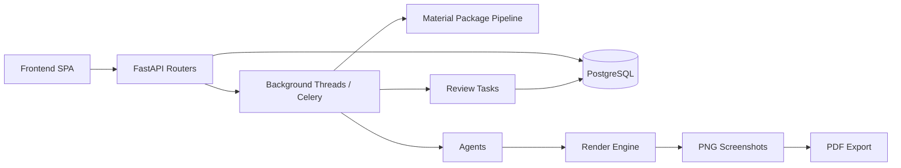
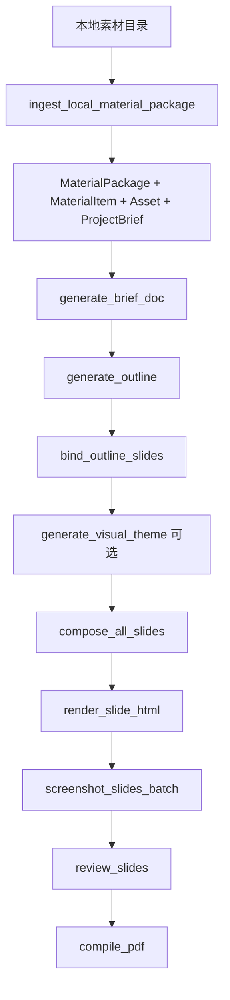

# PPT Agent 当前系统架构

> 更新时间：2026-04-14
>
> 本文档描述当前仓库已经实现并正在使用的系统架构。旧版以 `SlideSpec / PPTX / Orchestrator Agent` 为中心的设计思路，已不再能完整代表当前主链路。

---

## 1. 项目定位

PPT Agent 是一个面向建筑方案汇报场景的 AI 内容生产系统。当前主目标不是“直接生成可编辑 PPTX”，而是把建筑策划材料组织为一条可追踪、可重试、可审查的生成流水线，最终稳定输出 PDF。

系统当前更准确的产物链路是：

`MaterialPackage -> BriefDoc -> OutlineSpec -> SlideMaterialBinding -> LayoutSpec -> HTML -> PNG -> PDF`

其中：

- `MaterialPackage` 是当前主流程的事实源。
- `LayoutSpec` 是当前页面级核心协议。
- `PDF` 是当前主线导出产物。
- `PPTX` 仍属于规划方向，不是当前稳定交付能力。

---

## 2. 当前边界

当前系统已经实现或基本打通的能力：

- 本地素材包摄入
- 从素材包提取 `ProjectBrief`
- 基于素材包生成 `BriefDoc`
- 基于蓝图和素材上下文生成 `OutlineSpec`
- 按页做素材绑定
- 使用 LLM 并发生成 `LayoutSpec`
- 渲染 HTML 并截图为 PNG
- 合成 PDF
- 触发规则层和语义层审查

当前尚未作为稳定主线交付的能力：

- 原生 PPTX 导出
- 复杂前端编辑器
- 单独的 Orchestrator Agent 进程或 LangGraph 主控图
- 完整对象存储驱动的产物分发链
- 通用搜索引擎驱动的开放式知识检索

---

## 3. 设计原则

### 3.1 Workflow First

系统首先是工作流系统，其次才是 Agent 系统。核心要求是：

- 状态明确
- 中间结果可存档
- 失败可重试
- 局部问题可修复
- 每页内容尽量可追溯到素材来源

### 3.2 Material Package First

当前主流程以素材包为起点。素材包中包含图片、图表、表格、文档和文本证据，后续 Agent 直接或间接消费这些内容，而不是从自由对话直接生成整套内容。

### 3.3 Deterministic Core + LLM Layer

确定性层负责：

- 文件扫描与分类
- `logical_key` 归一化
- 资产派生
- 素材匹配与绑定
- HTML 渲染
- 截图与 PDF 编译
- 状态推进与任务调度

LLM 层负责：

- `BriefDoc` 叙事整理
- `OutlineSpec` 页级规划
- `VisualTheme` 视觉主题生成
- `LayoutSpec` 页面内容编排
- 审查解释与修复建议

### 3.4 Review Loop

渲染后进入审查阶段。当前已接入规则层和语义层审查，视觉审查和更强修复闭环仍在演进中。

---

## 4. 当前总体架构

### 4.1 前端层

当前前端是一个轻量 SPA，负责：

- 项目创建
- Brief 填写
- 触发大纲生成
- 确认大纲
- 查看项目状态
- 查看幻灯片截图
- 触发审查与导出

当前前端不是复杂设计编辑器，也不构成完整的地图绘制工作台。

### 4.2 API 与编排层

编排逻辑当前分布在以下位置：

- FastAPI 路由
- 路由内部后台线程
- Celery tasks

当前不存在单独落地的 `Orchestrator Agent` 模块。流程编排是分布式实现，而不是单一 Agent 决策中心。

### 4.3 Agent 层

当前仓库中的核心 Agent 为：

- `Intake Agent`
- `Reference Agent`
- `BriefDoc Agent`
- `Outline Agent`
- `MaterialBinding Agent`
- `VisualTheme Agent`
- `Composer Agent`
- `Critic Agent`

其中，`MaterialBinding Agent` 实际上是确定性匹配逻辑，不依赖 LLM，但在业务语义上承担了页级内容绑定职责。

### 4.4 Render / Export 层

渲染链路为：

- `LayoutSpec -> HTML`
- `HTML -> PNG`
- `PNG -> PDF`

当前主线导出是 PDF。PPTX 仍未形成完整实现闭环。

### 4.5 存储与基础设施层

当前实际主用基础设施：

- PostgreSQL
- Redis
- Celery
- Playwright
- 本地文件目录与静态文件挂载

对象存储、搜索引擎和更完整的外部产物分发能力在文档和规划中出现过，但不是当前仓库的主线依赖。

---

## 5. 当前主流程

### 5.1 流程总览

### 5.2 阶段说明

#### 阶段一：素材包摄入

输入本地目录，生成：

- `MaterialPackage`
- `MaterialItem`
- `Asset`
- `ProjectBrief`

该阶段完成后，项目进入 `MATERIAL_READY`。

#### 阶段二：BriefDoc 生成

`BriefDoc Agent` 从素材包摘要、文本摘录和项目 Brief 中提取叙事主线，产出 `BriefDoc`。

#### 阶段三：Outline 生成

`Outline Agent` 基于：

- `ProjectBrief`
- `BriefDoc`
- `MaterialPackage`
- `PPT_BLUEPRINT`

产出页级 `OutlineSpec`。

#### 阶段四：素材绑定

`MaterialBinding Agent` 为每页收集：

- 匹配的素材项
- 匹配的派生资产
- 证据摘要
- 覆盖率和缺失项

产出 `SlideMaterialBinding`。

#### 阶段五：视觉主题

系统支持生成项目级 `VisualTheme`。该能力在参考案例流和素材包脚本流中已接入，但在当前 HTTP 主流程中仍可能回退到默认主题。

#### 阶段六：页面编排

`Composer Agent` 逐页把 `OutlineSlideEntry + Binding + Theme` 转为 `LayoutSpec`。当前支持结构化 `LayoutSpec` 模式，也保留 HTML 直出模式的演进痕迹。

#### 阶段七：渲染

`Render Engine` 把 `LayoutSpec` 渲染为完整 HTML，并解析 `asset:{id}` 类型的资源引用。

#### 阶段八：审查

渲染完成后触发审查任务。当前主流程已接入规则层和语义层审查；更完整的视觉审查与自动修复闭环仍在持续完善。

#### 阶段九：导出

当前导出链路是：

`PNG screenshots -> PDF`

不是 `PPTX` 主线。

---

## 6. Agent 职责划分

### 6.1 Intake Agent

职责：

- 从自然语言提取项目字段
- 判断缺失信息
- 对 Brief 做结构化补全

该链路仍然存在，但已不再是当前唯一入口。

### 6.2 Reference Agent

职责：

- 案例召回
- 重排
- 偏好总结
- 为 `VisualTheme` 提供风格输入

这是保留中的另一条业务支线，不是当前素材包主流程的唯一依赖。

### 6.3 BriefDoc Agent

职责：

- 汇总素材包语义证据
- 输出叙事章节
- 生成定位语和叙事弧线

产物：`BriefDoc`

### 6.4 Outline Agent

职责：

- 基于蓝图生成页级提纲
- 把叙事结构映射到固定页槽
- 控制整套 deck 的章节顺序和页面目的

产物：`OutlineSpec`

### 6.5 MaterialBinding Agent

职责：

- 将 `Outline` 所需输入映射到素材包条目和派生资产
- 为每页生成证据片段和缺口分析

产物：`SlideMaterialBinding`

### 6.6 VisualTheme Agent

职责：

- 生成项目级字体、配色、间距和装饰规则
- 为编排与渲染阶段提供统一视觉上下文

产物：`VisualTheme`

### 6.7 Composer Agent

职责：

- 基于 `Outline + Binding + Theme` 生成页面级布局描述
- 控制文字密度、图文关系和版式骨架

当前核心产物不是旧版 `SlideSpec`，而是 `LayoutSpec`。

### 6.8 Critic Agent

职责：

- 解读审查结果
- 生成修复建议
- 支撑局部重生成闭环

---

## 7. 核心数据模型

### 7.1 项目与输入层

- `Project`
- `ProjectBrief`
- `MaterialPackage`
- `MaterialItem`

### 7.2 中间资产层

- `Asset`
- `BriefDoc`
- `Outline`
- `SlideMaterialBinding`
- `VisualTheme`

### 7.3 页面与导出层

- `LayoutSpec`
- `Slide`
- `Review` 相关记录
- 导出后的 PNG / PDF 文件

### 7.4 关于 SlideSpec

仓库中仍保留 `schema/slide.py::SlideSpec` 作为历史兼容模型，但它已不是当前渲染链路的核心协议。当前真正驱动渲染的是 `schema/visual_theme.py` 中定义的 `LayoutSpec`。

---

## 8. 当前状态机

当前 `ProjectStatus` 包含：

- `INIT`
- `INTAKE_IN_PROGRESS`
- `INTAKE_CONFIRMED`
- `REFERENCE_SELECTION`
- `ASSET_GENERATING`
- `MATERIAL_READY`
- `OUTLINE_READY`
- `BINDING`
- `SLIDE_PLANNING`
- `RENDERING`
- `REVIEWING`
- `READY_FOR_EXPORT`
- `EXPORTED`
- `FAILED`

其中，和当前素材包主流程直接相关的关键节点是：

`MATERIAL_READY -> OUTLINE_READY -> BINDING -> SLIDE_PLANNING -> REVIEWING -> READY_FOR_EXPORT -> EXPORTED`

---

## 9. 当前实现中的几个关键事实

### 9.1 编排不是单 Agent，而是多入口分布式调度

当前流程控制分散在：

- `api/routers/material_packages.py`
- `api/routers/outlines.py`
- `tasks/*.py`

因此，文档不应再把系统描述为“一个 Orchestrator Agent 调所有 Agent”的落地实现。

### 9.2 素材包已经是主事实源

当前主流程从本地素材目录开始，而不是从案例选择或纯自然语言会话开始。

### 9.3 导出是 PDF-first

当前可交付产物是 PDF。文档不应把 PPTX 作为已经稳定存在的主能力。

### 9.4 前端是流程页，不是编辑器

当前前端负责串联流程和查看状态，不负责复杂排版编辑。

---

## 10. 已知偏差与后续演进

以下点需要在理解系统时特别注意：

- `VisualTheme` 在素材包脚本流中可显式生成，但当前 HTTP 主流程仍可能回退到默认主题。
- `BriefDoc` 已接入 outline 生成链路，但部分老文档仍把它写成“已实现未接入”。
- 审查闭环已存在，但视觉审查与自动修复程度仍未完全达到设计目标。
- `SlideSpec`、`PPTX`、`Orchestrator Agent` 等旧叙述在历史文档中仍能看到，但不应再被视为当前主架构。

---

## 11. 当前一句话总结

当前 PPT Agent 的主架构可以概括为：

**一个以素材包为事实源、以 `LayoutSpec` 为页面协议、以 HTML 渲染和 PDF 导出为主线、通过 FastAPI + 后台线程 + Celery 串联多 Agent 的建筑汇报生成流水线。**

## 6.5 大纲与页面类 Tool
