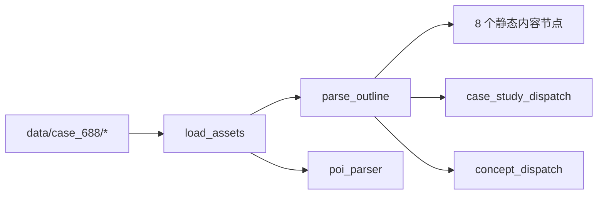

# 文档改版详细计划

> 基于对 9 篇现有文档 + 核心源码的通读，制定的全面改造计划。
> 目的：让第一次读项目、对 LangGraph 不熟悉的开发者读完后能深度理解项目。

---

## 关键事实修正（前置）

读完源码后发现一个**关键事实需要修正**——这会影响整套文档的措辞：

> **当前 pipeline 没有任何节点调用豆包 LLM。** [outline.py](../ppt_maker/nodes/outline.py) 完全是正则 + markdown 表格解析（[outline.py:19-79](../ppt_maker/nodes/outline.py#L19-L79)），没有 `DoubaoClient` 调用。`DoubaoClient` 类存在但**全项目无人使用**——它是为后续扩展预留的。

也就是说：今天的项目里，**LLM 只出现在概念方案 prompt 文本里（喂给 RunningHub 的图像生成模型），不出现在文字生成里**。这是文档现状最大的失真，整个改版要围绕这个事实重新立基。

---

## 一、改版总原则

| 原则 | 说明 |
|---|---|
| **每篇都得回答"输入→处理→输出"** | 用户给的例子要求的是这个，所有文档第一段必须给出 inputs / outputs / 一行流程 |
| **区分"四种内容来源"** | ① 硬编码 Python 字面量 ② 从输入资料抽取（规则） ③ 启发式打分 ④ 外部 API（图像/检索）。**LLM 文本生成当前为 0，但保留 DoubaoClient 钩子** |
| **明确"项目里没有什么"** | 没有审查节点、没有 LLM-as-judge、没有截图回看、没有缓存层（除 checkpoint）、没有内容质量检查 |
| **单一信息源（SSoT）** | 40 页表只在 pipeline.md；降级矩阵只在 configuration.md；组件 data 契约只在 templates.md；其他文档只摘要 + 链接 |
| **代码引用统一带行号** | 格式 `[file.py:N](file.py#LN)` 或 `[file.py:N-M](file.py#LN-LM)`，让读者点开即看 |
| **取舍要写"为什么"** | 不只列结论，必须解释设计动机（含错误尝试） |
| **每篇文档 ≤700 行**，超出就拆 | 当前文档都比较短，加新内容时注意控制 |
| **图优先于文字** | 涉及拓扑、数据流、状态变迁时优先用 mermaid 或 ASCII 图 |

---

## 二、跨文档需要复用的"资产"

这些资产先写一次，在多篇文档里只引用、不复制。

### 资产 A：四种内容来源分类表

```markdown
| 来源类别 | 含义 | 当前节点 | 是否走 LLM |
|---|---|---|---|
| Python 字面量 | 硬编码字符串/字典 | summary, cover_transition, ending | 否 |
| 规则抽取 | 正则/markdown 表格/Excel 列名映射 | outline, poi_parser, policy, location, economy, poi_analysis, metrics | 否 |
| 启发式打分 | 关键词命中数 → 数值 | policy._impact_score | 否 |
| 外部 LLM 文本 | 调豆包做摘要/抽取 | （当前无） | DoubaoClient 已就绪但未被调用 |
| 外部图像 | RunningHub text-to-image | culture, concept worker, cover_transition (logo/toc) | 是（图像模型） |
| 外部检索 | Tavily 搜索 | competitor_search | 否（直接进表格） |
```

### 资产 B：40 页生成来源表（增列）

在现有 [pipeline.md](pipeline.md) 表上**加两列**：

| 页码 | 内容 | 生成节点 | **来源类别** | **失败时显示** |
|---:|---|---|---|---|
| 1 | 封面 | cover_transition | 字面量 + RunningHub logo | logo 变 SVG |
| 4 | 政策解读 I | policy_research | 规则抽取（outline.policies[:4]） | 政策列表为空 |
| 6 | 政策影响图表 | policy_research | 规则 + 启发式打分 + matplotlib | 空白图表 |
| 22 | 同类产品检索 | competitor_search | Tavily | "未配置 TAVILY_API_KEY"说明 |
| 29-37 | 9 张概念图 | runninghub_worker | RunningHub | SVG 占位（hint=具体原因） |
| 19/26/39 | 综合页 | summary_node | **完全字面量** | （不会失败，无输入也产出） |

### 资产 C：从 case_688 抽出的"真实数据样本"

准备 4-5 个真实样本片段（用于多篇文档引用）：
- C1：一段输入 markdown（政策章节）
- C2：解析后的 `Policy` 对象（用 `model_dump_json` 打印）
- C3：对应的 `SlideSpec`
- C4：渲染产出的 HTML 片段
- C5：`logs/run.jsonl` 的 5 行典型样本（成功/降级/失败/超长耗时/0 产出）

放到 `docs/_assets/` 目录或者新文档 `docs/data-flow-walkthrough.md` 里，其他文档引用同一份。

### 资产 D：标准的"读完应该能回答"模板

每篇文档开头放：

```markdown
> **读完这篇，你应该能回答：**
> - 这个模块/链路的输入、输出、内部步骤是什么？
> - 哪些是硬编码、哪些是规则、哪些是 AI、哪些是外部 API？
> - 它怎么失败？怎么降级？怎么排查？
> - 我想改它的话，从哪一行开始动？
```

### 资产 E：标准 mermaid 风格

所有流程图统一用 mermaid（不是 ASCII），方便 IDE 预览。例如：



---

## 三、新增文档（4 篇）

### 新增 1：`docs/glossary.md` — 术语表

**长度**：1-2 屏

**内容**：
- LangGraph 概念：StateGraph / superstep / reducer / Send / fan-out / fan-in / conditional edges / checkpoint / thread_id
- 项目术语：语义键 / SlideSpec / ComponentKind / ProjectState / 降级 / barrier / case
- 外部服务：RunningHub / Tavily / 豆包 / Volcengine Ark
- 每条 1-2 句解释 + 主要出现在哪几篇文档

**作用**：所有其他文档第一次出现术语时链到这里，正文不再重复解释。

### 新增 2：`docs/llm-and-external-services.md` — AI 与外部服务全景

**长度**：~250 行

**章节**：

```markdown
## 一句话现状
当前 pipeline **不调用任何 LLM 做文本生成**。豆包客户端（DoubaoClient）已就绪但
未被任何节点引用；外部 AI 仅出现在 RunningHub 图像生成。

## 外部依赖一览
| 服务 | 用途 | 当前是否真的被调用 | 关键代码 |
|---|---|---|---|
| RunningHub | text-to-image | 是 | clients/runninghub.py |
| Tavily | 联网检索 | 是 | clients/tavily.py |
| 豆包 (Volcengine Ark) | LLM 文本 | **否（待接入）** | clients/doubao.py |

## RunningHub 调用细节
（给完整时序图：submit → poll → download → fallback）
- 端点、参数、轮询、重试、并发上限、缓存策略
- 三套 SVG 降级模板（PLACEHOLDER_SVG / PLACEHOLDER_SVG_LABELED / logo_svg）
- 跨线程并发控制：threading.Semaphore(5)（解释为什么不是 asyncio.Semaphore）
- 关键行号引用：runninghub.py:32-43, 126-173

## Tavily 调用细节
（端点、参数、缓存到 search_cache reducer）

## 豆包客户端（预留）
- 已实现 chat() / structured()
- 接入示例：把 policy_research._impact_score 换成 doubao.structured(...)
- 推荐 prompt 模板风格（参考 prompt.md）

## 没有什么
- 没有内容审查 / LLM-as-judge / 截图回看
- 没有 RAG / vector search
- 没有跨节点缓存（除 checkpoint）
- validate.py 只检查页数完整性，不检查质量

## 想加 LLM 节点该怎么做？
（指向 extension-guide.md 的对应小节）
```

### 新增 3：`docs/data-flow-walkthrough.md` — 一次完整运行的数据流走查

**长度**：~400 行

**结构**：以 case_688、`--dry-run` 为例，按时间顺序贴**真实数据片段**：

```markdown
## 0. 命令
python -m ppt_maker run --case 688 --dry-run --force

## 1. CLI 构造的初始 ProjectState
（贴 _build_state() 输出的 dict 示例）

## 2. load_assets 之后
- AssetIndex 内容（贴几个语义键 → 路径映射）
- UserInput / SiteCoords 解析结果

## 3. parse_outline 之后
- 输入：data/case_688/设计建议书大纲_688.md（贴政策章节原文 30 行）
- 解析步骤：
  ① _split_sections 把 md 拆成 {标题: 正文}
  ② _numbered_items 提取 "1. **政策标题** ..."
  ③ _bold_field 抽 **政策内容** / **对项目影响** / **来源链接**
- 输出：DesignOutline.policies[0] 的 JSON

## 4. policy_research 之后
- 输入：上一步的 outline.policies
- 启发式：_impact_score("提升居住品质") = 数关键词得 3
- matplotlib 生成 charts/policy_impact.png（贴一张缩略图）
- 输出：slide_specs[4..7] 的 SlideSpec.data

## 5. concept fanout 后的 9 个 worker
- fanout 发出的 9 个 Send（贴 list 长这样）
- 单个 worker 在 dry-run 下走 placeholder_svg
- 输出：slide_specs[29..37]

## 6. aggregate_specs 之后
- 兜底逻辑：补缺页 [missing page N]
- 落盘 slide_specs.json（贴前 3 页）

## 7. render_html 之后
- HtmlRenderer 渲染单页（贴 chart 组件渲染前后对照）
- base64 内联图片：embed_image() 把 chart_path → data:image/png;base64,...
- 最终 index.html 体积参考

## 8. logs/run.jsonl 全量
（贴一份完整 case_688 的 jsonl，约 20 行，含成功/降级条目）
```

### 新增 4：`docs/diagrams.md` — 图集

**长度**：图为主，文字说明为辅

**内容**：把所有需要的 mermaid 图集中放，其他文档按需引用：
- 图 1：分层架构（CLI / 编排 / 状态 / 节点 / 客户端 / 渲染 / 输出）
- 图 2：完整 LangGraph 拓扑（含两组 Send）
- 图 3：superstep 时序（横轴时间，纵轴节点，标注哪些并发）
- 图 4：HtmlRenderer 内部数据流（SlideSpec → Jinja2 ctx → component → base → HTML）
- 图 5：RunningHub 调用时序（submit/poll/download/fallback）
- 图 6：reducer 合并时序（两个并发节点写不同 page）
- 图 7：checkpoint 与 thread_id 关系（同 case 多次运行）

---

## 四、按文档逐篇详细改造计划

### ★ [docs/README.md](README.md) — 总入口

**保留**：
- 阅读顺序表（更新加入 4 篇新文档）
- 关键代码入口表
- 最常用命令

**新增章节（按顺序）**：
1. **"输入 → 输出全景图"**（mermaid 图，引用 diagrams.md 的图 1+2 简化版）
2. **"LLM 现状一句话"** ← 解决最大误解："当前文本生成全部由规则代码完成，LLM 仅在外部图像服务被调用。豆包客户端已就绪但未被使用。"
3. **"项目里没有什么"** 列表：无内容审查、无 LLM 复审、无截图回看、无 RAG、无跨节点缓存
4. **"读完整套文档应该能回答的 10 个问题"**：明确目标
5. 阅读顺序表加入 glossary.md（先读）和 llm-and-external-services.md、data-flow-walkthrough.md、diagrams.md

**移除**：把过于啰嗦的"先建立心智模型"段落改成 1-2 句。

---

### ★ [docs/architecture.md](architecture.md) — 分层架构

**核心目标**：从"系统视角"讲清楚分层与取舍，**不**重复 pipeline 流程。

**改动**：

1. **删掉**与 pipeline.md 重叠的内容：现在的"渲染层"小节里那些步骤说明应移到 templates.md
2. **重写"关键设计取舍"** 4 条：
   - 每条加 **"考虑过什么替代方案"** 和 **"代价是什么"**
   - 例如取舍 1 改写：
     ```
     先 SlideSpec 再 HTML——为什么不直接让节点写 HTML？
     考虑过：节点直接拼 HTML，节省一层转换。
     放弃原因：1) 视觉模板要可换；2) inspect/render-only 调试需要；
              3) 多节点并发产 HTML 难合并。
     代价：每加一个组件要同步改 ComponentKind + 模板 + 数据契约 4 处
     ```
3. **新增"线程模型"小节**：
   - LangGraph 同 superstep 节点用 ThreadPool 并发
   - 每 worker 调 `asyncio.run(client.generate(...))` 自起 event loop
   - 因此 RunningHub 用 `threading.Semaphore`（cross-thread）而非 `asyncio.Semaphore`
   - 引用 [runninghub.py:32-33](../ppt_maker/clients/runninghub.py#L32-L33)
4. **新增"模块依赖图"**（mermaid）：箭头表示 import 关系
5. **新增"哪些字段是 reducer，哪些不是"**（从 state.py 抽出来的对照表，目前散落多处）
6. **新增"全局常量分布"** 表（用户改总页数会踩坑的关键）：
   ```
   "40 页"硬编码出现在：
   - aggregate.py:17 range(1, 41)
   - validate.py:17,19 expected 40
   - html_renderer.py:54-58 section_for_page
   - cover.py:7-16 TOC_ENTRIES
   - concept.py:18,28-32 fanout 9 个
   - templates/*/components/_chrome.html.j2
   - 各 transition 页的硬编码页码（cover.py 的 specs 字典 keys）
   ```

---

### ★ [docs/pipeline.md](pipeline.md) — 一次运行链路

**核心目标**：让读者通读后能复述整条链路。

**改动**：

1. **阶段 0（新增）：CLI 入口的预处理**
   - `_build_state()` 做了什么
   - 读 `.env`、解析参数、创建 output_dir
2. **阶段 1（保留）**：略改文字
3. **阶段 2 加细节**：
   - load_assets 详述：`_SUFFIX_RE = r"_\d+(?:_\d+)?$"` 怎么吃文件名（举几个具体例子）
   - parse_outline **澄清**：纯正则，**不调 LLM**，给一个具体输入→输出片段，引用 walkthrough
   - poi_parser：列出 SHEET_MAP（从代码抽出来），说明 sheet 名不匹配时的行为
4. **阶段 3 重写**——用资产 A "四种来源分类"代替简单"并行"描述：
   ```
   并行的 8 个内容节点 + 2 组 Send worker，按"内容来源"可分为：
   - 字面量为主：summary_node, cover_transition
   - 规则抽取为主：policy, location, economy, poi_analysis, metrics
   - 启发式：policy._impact_score
   - 外部图像：culture, concept, cover_transition.logo/toc
   - 外部检索：competitor_search
   注：parse_outline 完成后才能并行，因为大多数节点读 outline 字段
   ```
5. **40 页表**：增加资产 B 的两列（来源类别 / 失败时显示）
6. **阶段 4 加细节**：
   - 解释 superstep 概念（一次性，引用 langgraph.md）
   - 解释为什么需要**两个** barrier（content_join + barrier）：因为 Send worker 不在 content_join 的 superstep
7. **阶段 5 加细节**：
   - aggregate_specs 的兜底页 schema（引用 aggregate.py:19-23）
   - validate 只检查 3 件事：页数=40、页码连续、index.html 存在；**不检查内容质量**
8. **错误与降级章节**：精简，把详细降级矩阵指向 configuration.md（避免重复）

---

### ★ [docs/langgraph.md](langgraph.md) — LangGraph 构造

**核心目标**：让没用过 LangGraph 的人也能看懂构图。

**改动**：

1. **首段加"如果你刚接触 LangGraph"**（约 30 行）：
   ```
   - StateGraph(SchemaT)：图持有的全局状态以 SchemaT 描述
   - 节点函数：(state) -> 局部更新 dict
   - 边：固定依赖关系
   - 条件边 + Send：动态 fan-out
   - reducer：当多个并发节点写同一 key 时如何合并
   - superstep：拓扑里"同时刻可执行"的一批节点；下一 superstep 等上一 superstep 全部完成
   - checkpoint：每个 superstep 结束后落盘，可恢复
   - 一句话：把 ProjectState 想成一个会被多人同时编辑的共享 dict，reducer 决定怎么合并冲突
   ```
2. **"为什么需要两层 barrier"**（专门一节，当前文档没说清）：
   - 画 superstep 时序图（资产 E）
   - content_join 是静态节点的汇合点（superstep N+2）
   - barrier 还要等 Send worker（superstep N+3）
   - 没这层会怎样：summary_node 可能在 worker 还没写 page 29 时执行
3. **"`_wrap_with_timer` 全解"**（专门一节）：
   - 完整代码贴上（[graph.py:44-61](../ppt_maker/graph.py#L44-L61)）
   - 三个职责：计时、产页计数、异常隔离
   - 异常路径：`return {"errors": [NodeError(...)]}`，graph 不崩
   - jsonl 事件 schema（每行 JSON 的字段）
4. **"reducer 合并示例"**（资产 C 的并发例子，带前后对照 dict）：
   ```python
   # 节点 A 返回
   {"slide_specs": {18: spec_a}}
   # 节点 B 同 superstep 并发返回
   {"slide_specs": {21: spec_b}}
   # merge_dict 合并后 state["slide_specs"] =
   {18: spec_a, 21: spec_b}
   # 注意：右侧覆盖左侧。同 page 重复写入会丢前一个
   ```
5. **"checkpoint 工作机制"** 加细节：
   - sqlite 表结构概述（不必深入但提一下）
   - 同 case 第二次运行：哪些节点会重跑、哪些会跳过
   - `--force` 实际做了什么：删 sqlite 文件，等价于全新 thread
6. **"Send worker 的 state 传递"**：
   ```python
   Send("runninghub_worker", {"scheme_idx": i, "view": v, **state})
   ```
   - 解释为什么要 `**state`：worker 是独立调用，需要拿到 outline / output_dir
   - 解释 worker 的返回值如何被 reducer 收集
7. **"我新加节点时常见的坑"** 列表：
   - 忘记给字段加 reducer → 并发覆盖
   - 忘记连边 → 节点永不被调
   - 忘记进 NODE_REGISTRY → KeyError
   - 用 Pydantic model 字段当 reducer key → 必须可哈希

---

### ★ [docs/data.md](data.md) — 数据契约

**核心目标**：所有 schema 的"权威说明"。

**改动**：

1. **首段加 schema 总览图**（mermaid）：input file → AssetIndex → 各 Pydantic 模型 → SlideSpec
2. **每个 Pydantic 模型加"字段语义"列**——目前只有结构，缺解释。例如：
   ```
   class Policy(BaseModel):
       title: str          # 政策全称，display 时会做 [:14] 截断（policy.py:42）
       content: str        # 政策内容正文
       impact: str         # 对项目影响描述；_impact_score 会从这里数关键词
       source_url: str     # 政策原文链接，可空
       publish_year: int | None  # 从 title 中正则提取 r"(\d{4})年"，没匹配则 None
   ```
3. **每个 schema 加"由哪个节点产生 / 由哪些节点消费"** 矩阵：
   ```
   | schema | 产生 | 消费 |
   |---|---|---|
   | DesignOutline | parse_outline | policy, location, economy, culture, cover_transition,
   |               |               | competitor_search, case_study, concept, summary |
   | POIData | poi_parser | poi_analysis |
   | UserInput | load_assets | summary, cover_transition, metrics |
   ```
4. **"reducer 字段全表"**——目前只有 4 个 reducer，但说明详略不一。补全：
   - merge_dict 的语义、冲突时的覆盖规则
   - operator.add 用于 errors[] 的语义
   - 哪些字段**不是** reducer（assets/outline/poi_data 等单写字段）
5. **"语义键完整列表"**（资产）：从 case_688 真实抽取出当前已知的语义键，并标注哪些是必需、哪些可选。
6. **"`SlideSpec.data` 是松耦合的"**——专门强调：
   - data 是 `dict[str, Any]`，Pydantic 不校验内容
   - 模板字段名打错只会安静地不显示（ChainableUndefined）
   - 这是常见 bug 来源，写入 SlideSpec 前最好用 TypedDict 或局部 BaseModel 校验
7. **修正错误信息**：当前文档说"解析逻辑主要是正则…不是 LLM 强依赖"——改成 **"完全是正则解析，零 LLM 调用"**，并指明这是当前实现，未来可换 LLM。

---

### ★★★ [docs/templates.md](templates.md) — 模板系统（用户点名重写）

**核心目标**：用户给的 4 条要求**全部回答到**。

**新结构**：

```markdown
# 模板系统

> 读完应能回答（资产 D）

## 一句话定位
模板系统接收 sorted list[SlideSpec]，输出单文件 index.html
（图片以 base64 内联，可双击打开）。

## 1. 总体流程

### 输入
- 类型：list[SlideSpec]，已按 page 排序，aggregate_specs 保证 1-40 都有
- 每个 SlideSpec：page / component / title / subtitle_en / data / notes
- 模板**不**关心节点是怎么生成 spec 的，也不知道有 LangGraph

### 输出
- 单文件 index.html：标准 HTML5 + 内联 <style> + 40 个 <section class="slide">
- 所有图片以 data:URI 内联（embed_image）；无外部资源依赖
- 典型体积：dry-run ~3 MB；带 RunningHub 真实图 ~30-80 MB

### 内部步骤（HtmlRenderer）
1. __init__：
   - 读 templates/<template>/theme.json
   - 读 templates/<template>/viewport-base.css
   - 建 Jinja2 Environment
     * loader 同时挂根目录和 components/，所以 base.html.j2 和 cover.html.j2 都能直接 get_template
     * autoescape on .html  → 防 XSS
     * ChainableUndefined  → data.foo.bar.baz 缺失不报错
     * trim_blocks / lstrip_blocks → 模板里的空白控制
   - 注册 embed_image 全局函数 + safe_number filter
2. render() 主循环：
   for spec in specs:
       html_chunk = render_slide(spec)
   把 list[str] 喂给 base.html.j2，注入 theme + viewport_css
3. render_slide()：
   - 选 components/<spec.component>.html.j2
   - 计算 section（HtmlRenderer.section_for_page()）
   - 注入完整上下文（spec / page / title / data / theme / section /
                    section_cn / section_en / project_title）
   - 模板内可调 chrome() 宏画页眉/页脚

代码：html_renderer.py:69-96

## 2. 数据格式（每个组件的 data 契约）

（保留现有契约表，但每个字段补"渲染时怎么用"和"缺失/为空时怎样"）

### 例：concept_scheme
| 字段 | 类型 | 模板里如何使用 | 缺失/为空时 |
|---|---|---|---|
| scheme_idx | int | <data-scheme>{{idx}}</data-scheme> 用于锚点 | 渲染为空字符串 |
| scheme_name | str | <h2>{{ scheme_name }}</h2> | 标题为空 |
| view | "aerial"/"exterior"/"interior" | 决定布局变体的 CSS 类 | 默认布局 |
| view_label | str | "鸟瞰图"/"室外人视"/"室内人视" | 空文字 |
| image | str (path) | embed_image(image) 转 data:URI | embed_image 返回 ""， src 空 |
| idea | str | 段落 | 空段落 |
| analysis | str | 段落 | 空段落 |
| prompt | str | 仅作 dev hint，可隐藏 | 空字符串 |

（每个组件都要写这种细化表。chart/case_card/policy_list 是优先级最高的几个）

## 3. 实现思路与取舍（用户最关心）

### 3.1 为什么先 SlideSpec 再 HTML
- 解耦节点和视觉
- 可调试：slide_specs.json 落盘
- 可换皮：复制 templates/ 改 theme.json

### 3.2 哪些是预先规定的（"硬编码"）
- 40 页的页码-章节映射（html_renderer.py:54-58）
- 章节中英标签（html_renderer.py:60-67）
- 章节色 / palette / 字体（theme.json）
- 11 种组件骨架（components/*.html.j2）
- 目录页 4 章节文案（cover.py:7-16）
- 转场页 04 个文案（cover.py:60-78）

### 3.3 哪些是动态填入的
- spec.title / subtitle_en / data 的内容
- chart 是 matplotlib 实时生成的 PNG（不是模板预置）
- 概念方案的图（RunningHub 生成或 SVG 占位）
- logo / TOC illustration（同上）

### 3.4 LLM 在哪一步起作用？
**当前 0 处。** 文字内容全部由 Python 字面量 + 正则抽取产出。
RunningHub 是图像模型不是 LLM。
DoubaoClient 已实现但未接入任何节点；如要在某个文字位置加 LLM 摘要，
应在节点层写入 spec.data，模板层不变。详见 llm-and-external-services.md。

### 3.5 有没有"审查 / 校对"环节？
**没有。** 不存在的环节包括：
- 内容质量审查
- LLM-as-judge
- 截图回看
- 拼写/术语检查
- 渲染后视觉对比

唯一的检查是 validate.py：
- 是否 40 页齐全
- 页码是否连续
- index.html 是否存在
不检查 spec.data 是否符合组件契约。

如果要加审查，建议加在 render_html 之后、validate 之前，新建一个节点
读 index.html 截图喂给 vision LLM 比对——但项目当前不做。

### 3.6 单文件 HTML 的取舍
- 选择：所有图片 base64 内联（embed_image，html_renderer.py:40-51）
- 好处：一个文件，可双击/邮件附件/分享
- 代价：体积大；浏览器解码大量 data:URI 略慢
- 替代方案（项目放弃）：output assets/ 同目录引用 → 不便分享
- 替代方案（项目放弃）：CDN 上传 → 引入运维负担

### 3.7 ChainableUndefined 的隐患
data.foo.bar.baz 任意一段缺失 → 渲染空字符串而非报错。
好处：节点偷懒、字段可选都不会崩。
代价：模板里字段名打错也不报错——常见 bug 来源。
排查：见 debugging.md "样式错乱" 小节。

## 4. 主题与公共 chrome
（保留当前 theme.json 段落 + _chrome 段落，无需大改）

## 5. 添加新模板 / 新组件
（保留当前内容，加一句指向 extension-guide.md）
```

---

### ★ [docs/configuration.md](configuration.md) — 配置与降级

**核心目标**：所有"运行环境/参数/降级"的权威。

**改动**：

1. **新增"外部 API 调用细节"完整小节**（消化 RunningHub 部分）：
   ```
   ### RunningHub
   - 端点：POST https://www.runninghub.cn/openapi/v2/rhart-image-n-pro/text-to-image
   - 认证：Bearer <RUNNING_HUB_KEY>
   - 请求体：{prompt, aspectRatio, resolution}
       * prompt 上限 20000 字符
       * aspectRatio 限定枚举（1:1, 16:9, 9:16, ...）
       * resolution: 1k/2k/4k
   - 提交后返回 taskId
   - 轮询：POST /openapi/v2/query，每 3s 一次，最多 300s
   - 状态机：SUCCESS / FAILED / 进行中
   - 重试：3 次 transient（5xx + 网络异常）；2s/4s 指数退避
   - 并发：threading.Semaphore(5) 跨线程
   - 失败：写 SVG 占位，hint 标具体原因（"no API key"/"api error: TimeoutError"/...)
   - 文件保存：尊重服务端返回的 outputType（jpg vs png）
   ```
2. **同样写 Tavily / 豆包**（豆包标"未启用"）
3. **降级矩阵加列**：
   - "工作流是否中断"
   - "deck 是否仍可生成"
   - "用户是否能感知"
4. **新增"成本与时长参考"** 表：
   - dry-run 全链路约 ?s
   - 真实运行约 ?s（其中 RunningHub 占 ?s）
   - 每运行调用次数：RunningHub ~11（9 概念 + logo + toc + N 个 culture）
   - Tavily ~1
5. **CLI 命令加 examples + 何时用** 列：
   - 当前只有命令名和参数，加"什么场景用这个"
6. **修正现状**：当前文档写 `--no-images` 等价于 `--dry-run`——确认一下代码是否真这样实现

---

### ★ [docs/debugging.md](debugging.md) — 排查手册

**核心目标**：按"症状 → 诊断 → 修复"组织。

**改动**：

1. **重构成分级 troubleshooting**：
   ```
   ## 第一级：先看这三处（90% 的问题）
   - inspect 单页 spec
   - logs/run.jsonl
   - slide_specs.json
   
   ## 第二级：按症状索引
   ### 缺页 [missing page N]
   ### 图片不显示
   ### 第 22 页空表
   ### 概念图全是 SVG 占位
   ### 章节色错乱
   ### 模板字段不显示（新增！讲 ChainableUndefined）
   ### 改了代码没生效（讲 checkpoint）
   ### 中文方块（讲字体）
   ### 节点超时
   ### slide_specs.json 路径是旧绝对路径
   
   ## 第三级：极端情况
   ### graph 直接崩（不该发生，但有可能）
   ### 内存爆/asyncio 报错
   ### checkpoint sqlite 损坏
   ```
2. **新增 "ChainableUndefined 静默失败"**（最高价值新增项）：
   - 症状：模板某字段什么也没显示，inspect 看 data 字段也存在
   - 原因：模板里字段名拼错，或层级写错
   - 排查：把模板对应行的 `{{ data.foo }}` 临时改成 `{{ data.foo or "MISSING" }}`
   - 长期：考虑给 SlideSpec.data 加 TypedDict 校验
3. **新增"页面渲染顺序问题"**：
   - 如果某节点写错 page 号导致冲突，merge_dict 会让后写者覆盖
   - 怎么排查：grep 所有节点的 page= 字面量，跟 40 页表对照
4. **新增"概念图 prompt 不对"**：
   - 三个 prompt 来源：outline.concept_schemes[i].prompt_aerial/exterior/interior
   - 没解析到时 fallback：concept.py:58-59 默认 prompt
5. **新增"summary_node 内容不像我项目"**：
   - 因为是**完全硬编码**，不依赖输入
   - 修复方式：直接改 summary.py 字面量，或新增节点覆盖 19/26/39
6. **每个症状条目加"相关代码 + 行号"** 列

---

### ★ [docs/extension-guide.md](extension-guide.md) — 扩展指南

**核心目标**：常见演进任务的 step-by-step。

**改动**：

1. **重排目录**，按"演进难度"分级：
   ```
   ### Level 1：改文案/视觉
   - 改 summary_node 的硬编码文案
   - 改 cover_transition 的章节过渡文字
   - 改 theme.json 的颜色/字体
   - 改单个组件的 HTML/CSS
   
   ### Level 2：改数据/逻辑
   - 加新输入文件类型
   - 改某个节点的解析规则
   - 把启发式打分换成豆包 LLM 调用 ← 新增高频场景
   
   ### Level 3：加新结构
   - 加新内容节点（已有）
   - 加新页面组件（已有）
   - 加新模板风格（已有）
   
   ### Level 4：改架构
   - 修改总页数（已有，但要补全 checklist）
   - 换图像供应商（已有）
   - 加内容审查节点 ← 新增
   - 加跨节点缓存层 ← 新增
   ```
2. **新增"把启发式换成 LLM"完整 walkthrough**（以 policy._impact_score 为例）：
   ```python
   # 改前
   def _impact_score(impact: str) -> int:
       pos = sum(1 for w in [...] if w in impact)
       return max(2, min(5, 2 + pos))
   
   # 改后
   from ..clients.doubao import DoubaoClient
   from pydantic import BaseModel
   
   class ImpactScore(BaseModel):
       score: int  # 1-5
       reason: str
   
   def _impact_score(impact: str) -> int:
       client = DoubaoClient()
       if not client.available:
           return _heuristic_score(impact)  # 保留兜底
       try:
           result = client.structured(
               ImpactScore,
               system="你是一个建筑政策评估专家...",
               user=f"评估以下政策对项目的影响：{impact}",
           )
           return result.score
       except Exception as e:
           log.warning("LLM scoring failed: %s", e)
           return _heuristic_score(impact)
   ```
   关键点：始终有兜底；缺 key 直接走兜底；超时/异常走兜底。
3. **新增"加内容审查节点"**：
   ```
   - 新建 ppt_maker/nodes/review.py
   - 节点接收 slide_specs，调 LLM 比对内容一致性
   - 在 graph.py 加边：render_html → review → validate
   - 注意 review 不应失败时阻断渲染
   ```
4. **修正"修改总页数"checklist**——加上：
   - cover.py:7-16 (TOC_ENTRIES)
   - cover.py 的 transition 页码字面量
   - concept.py:18,28 (3×3 fanout)
   - case_study.fanout（待确认）
   - summary.py:74-87 (19/26/39 三页)
5. **加"扩展前的 self-test"清单**（保留现有的 + 加几条）：
   - 加 dry-run 跑通了吗？
   - render-only 能复现吗？
   - logs/run.jsonl 有这个节点的成功条目吗？
   - 新组件在所有 4 个章节里看着都正常吗？

---

## 五、文档级元数据规范（每篇统一）

每篇文档头部统一加：

```markdown
---
title: 一句话标题
audience: 第一次读项目的开发者 / 维护者 / 架构师（选一个或多个）
read_time: 8 分钟
prerequisites: glossary.md（必须先读）
last_verified_against: f083adb（git 短哈希，校对时使用的 commit）
---

# 标题

> **读完这篇你应该能回答：**（资产 D 模板）

> **关联文档：**
> - 上一篇：[xxx.md](xxx.md)
> - 下一篇：[yyy.md](yyy.md)
> - 深度延伸：[zzz.md](zzz.md)
```

`last_verified_against` 这条最有价值——文档跟代码会脱节，必须能追溯校对版本。

---

## 六、改造执行顺序与工作量预估

| 优先级 | 任务 | 估时 | 依赖 |
|---:|---|---:|---|
| P0 | 新增 glossary.md | 1h | 无 |
| P0 | 新增 llm-and-external-services.md | 3h | 无 |
| P0 | 重写 templates.md（用户点名） | 4h | 无 |
| P0 | 修正 data.md 中"outline 用 LLM"的错误说法 | 0.5h | 无 |
| P0 | README.md 加"LLM 现状"一段 + 新文档导航 | 1h | 上面几篇 |
| P1 | 重构 pipeline.md（增列 + 来源分类） | 3h | llm-doc |
| P1 | 重写 langgraph.md（superstep + barrier 解释） | 3h | glossary |
| P1 | 重写 debugging.md（按症状） | 2.5h | 无 |
| P1 | 配置 configuration.md（外部 API 详细） | 2h | llm-doc |
| P2 | 新增 data-flow-walkthrough.md | 4h | 需要跑一次 case_688 抓数据 |
| P2 | 新增 diagrams.md | 3h | 其他文档基本稳定后 |
| P2 | 重构 architecture.md（去重 + 加线程模型） | 2h | pipeline.md 完成 |
| P2 | 改 extension-guide.md | 2.5h | 其他都完成 |
| P3 | 给所有文档加 frontmatter + 关联导航 | 1h | 全部完成后 |
| P3 | 全文档代码引用补行号 | 1.5h | 同上 |

**总计：~34 小时。** 单人推进 4-5 天，可分 4 个 PR：

- PR 1（P0）：纠错 + 关键新文档（templates.md / llm-and-external-services.md / README / data.md 修正）
- PR 2（P1）：流程文档重构（pipeline / langgraph / debugging / configuration）
- PR 3（P2）：扩展资产（walkthrough / diagrams / architecture / extension-guide）
- PR 4（P3）：元数据与一致性扫尾

---

## 七、改完后的验证清单

每篇文档改完后跑一遍：

- [ ] 第一次接触项目的人读完能复述输入/输出/流程吗？
- [ ] 文档中提到的所有文件路径都还存在吗？
- [ ] 文档中提到的所有行号都对得上吗？
- [ ] 同一概念在多篇文档里说法一致吗（用资产 A/B 校对）？
- [ ] 没有"看 xxx 节点"但不给链接的悬空引用？
- [ ] 每个 mermaid/ASCII 图在 IDE 里渲染正常？
- [ ] 把 git HEAD 切到 last_verified_against 之外的 commit 时，文档明显落伍的部分能很快识别？

最后一项可以自动化：写个脚本扫所有文档里的 `[file.py:N](file.py#LN)` 引用，去 grep 那一行的代码片段是否还存在。

---

## 八、特别提醒（动手前要确认的几件事）

1. **outline.py 是不是真的不调 LLM**——读到的是 100% 正则，但 prompt.md 文件存在（[根目录](../README.md) 有），需要确认那是历史还是计划
2. **`--no-images` 是否真等价于 `--dry-run`**——[configuration.md](configuration.md) 这么说，但我没在代码里直接看到这个映射
3. **case_study_dispatch 的 fanout 数量**——文档写 3，但代码没读，要去 case_study.py 确认
4. **culture_node 是否调 RunningHub**——文档说调，要去 culture.py 确认
5. 每个新增的 mermaid 图都要在本地 IDE 渲染验证一次，避免语法错误
