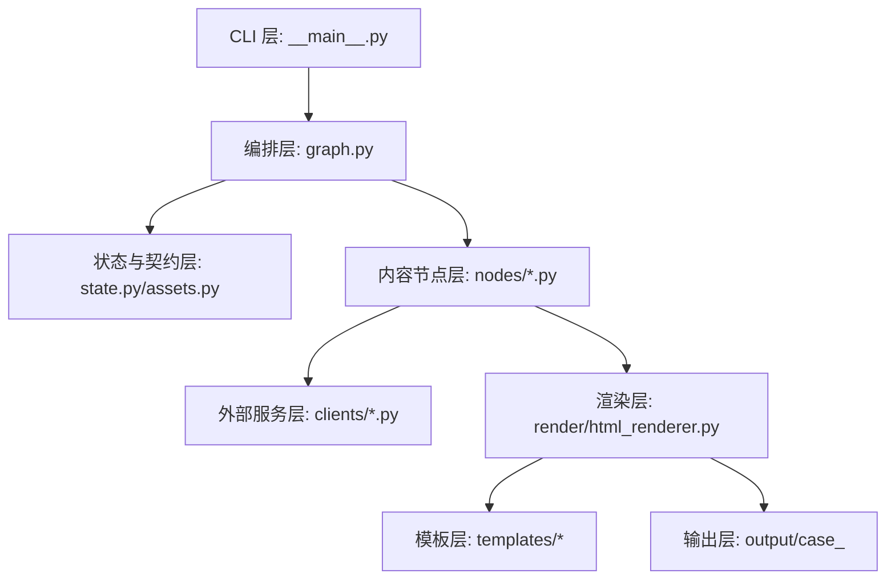

# 系统架构

> **读完这篇，你应该能回答：**
> - 项目分成哪些层，每层边界是什么？
> - 关键设计取舍为什么这样做，代价是什么？
> - 线程模型、reducer、全局常量分别有哪些维护风险？
> - 想做架构级改动时应该先看哪里？

> **关联文档：**
> - 主链路：[pipeline.md](pipeline.md)
> - 图集：[diagrams.md](diagrams.md)
> - 扩展：[extension-guide.md](extension-guide.md)

## 分层架构



| 层 | 责任 | 不该做什么 |
|---|---|---|
| CLI | 解析命令、建初始 state、处理 checkpoint 参数 | 不生成页面 |
| 编排 | 注册节点、连边、fan-out、barrier、checkpoint | 不写业务内容 |
| 状态与契约 | 定义 Pydantic schema、reducer、语义键索引 | 不做渲染 |
| 内容节点 | 读取输入和 state，产出 `SlideSpec` | 不拼最终 HTML |
| 外部服务 | 封装 RunningHub、Tavily、豆包预留 | 不决定页面结构 |
| 渲染 | `SlideSpec` 到 HTML | 不调用 LLM 或业务 API |
| 输出 | 保存 HTML、spec、日志、checkpoint、资源 | 不承载业务逻辑 |

## 模块依赖图

```mermaid
flowchart LR
  main[__main__.py] --> graph[graph.py]
  graph --> registry[nodes/__init__.py]
  graph --> state[state.py]
  registry --> nodes[nodes/*.py]
  nodes --> state
  nodes --> clients[clients/*.py]
  nodes --> charts[render/charts.py]
  nodes --> renderer[render/html_renderer.py]
  renderer --> state
  renderer --> templates[templates/*]
```

## 关键设计取舍

### 1. 先 `SlideSpec` 再 HTML

考虑过：节点直接拼 HTML，少一层转换。

放弃原因：

| 原因 | 说明 |
|---|---|
| 模板要可替换 | 节点直接写 HTML 会把内容和视觉绑死 |
| inspect/render-only 需要中间结果 | `slide_specs.json` 是调试边界 |
| 并发节点难合并 HTML | dict reducer 合并 `SlideSpec` 更简单 |

代价：新增组件时要同步改 `ComponentKind`、节点数据、组件模板和 [templates.md](templates.md)。

### 2. 节点失败不阻断整份 deck

考虑过：任何节点失败就终止。

放弃原因：建筑汇报生成更需要“先拿到一份可检查的 deck”，一张图或一个表失败不该让 40 页都没有产物。

代价：最终 HTML 可能成功生成，但里面有缺页占位或局部空白，所以必须看 `logs/run.jsonl`。

### 3. 用 checkpoint 复用昂贵节点

考虑过：每次都从头跑，结果最直观。

放弃原因：RunningHub 图像生成耗时长，重复跑成本高。

代价：调试代码时可能复用旧状态，必须知道 `--force` 的作用。

### 4. `SlideSpec.data` 保持松耦合

考虑过：给每个组件 data 建严格 Pydantic schema。

放弃原因：早期迭代中组件字段变化频繁，松耦合更快。

代价：模板字段名拼错时可能静默渲染为空。长期应对高价值组件补局部 schema。

## 线程模型

LangGraph 同一个 superstep 中的节点可能并发执行。图像节点内部调用 async client 时，会在当前线程里用 `asyncio.run()` 启动 event loop。

因此 RunningHub 的全局并发限制使用：

```python
_CONCURRENCY_SEM = threading.Semaphore(MAX_CONCURRENCY)
```

代码：[runninghub.py:32-33](../ppt_maker/clients/runninghub.py#L32-L33)

这比 `asyncio.Semaphore` 更合适，因为限制要跨多个 LangGraph worker 线程生效。

## reducer 字段和非 reducer 字段

| 字段 | reducer | 写入方式 |
|---|---|---|
| `slide_specs` | `merge_dict` | 多节点并行写不同页 |
| `charts` | `merge_dict` | 多节点写图表路径 |
| `generated_images` | `merge_dict` | 多节点写生成图路径 |
| `search_cache` | `merge_dict` | 搜索结果缓存 |
| `errors` | `operator.add` | 异常列表追加 |

非 reducer 字段应由单个节点写：

| 字段 | 写入节点 |
|---|---|
| `assets` | `load_assets` |
| `user_input` | `load_assets` |
| `site_coords` | `load_assets` |
| `outline` | `parse_outline` |
| `poi_data` | `poi_parser` |
| `output_html` | `render_html` |

## 全局常量分布

改总页数或章节结构时，需要同步检查：

| 常量 | 位置 | 含义 |
|---|---|---|
| `range(1, 41)` | [aggregate.py:17](../ppt_maker/nodes/aggregate.py#L17) | 补齐 40 页 |
| `expected 40` / `range(1, 41)` | [validate.py:18-19](../ppt_maker/nodes/validate.py#L18-L19) | 校验 40 页 |
| 章节页码边界 | [html_renderer.py:54-58](../ppt_maker/render/html_renderer.py#L54-L58) | 页码到章节映射 |
| 章节中英文标签 | [html_renderer.py:61-67](../ppt_maker/render/html_renderer.py#L61-L67) | chrome 显示 |
| 目录四章文案 | [cover.py:7-16](../ppt_maker/nodes/cover.py#L7-L16) | 目录页 |
| 转场页页码 | [cover.py](../ppt_maker/nodes/cover.py) | 3、13、20、27 |
| 概念方案 3x3 | [concept.py:28-39](../ppt_maker/nodes/concept.py#L28-L39) | 29-37 页 |
| 总页码显示 | [components/_chrome.html.j2](../templates/minimalist_architecture/components/_chrome.html.j2) | 页码视觉 |

## 当前架构边界

当前没有内容审查节点、截图回看、RAG、LLM-as-judge，也没有跨节点业务缓存层。豆包客户端是预留能力，不是当前 pipeline 的文字生成来源。
