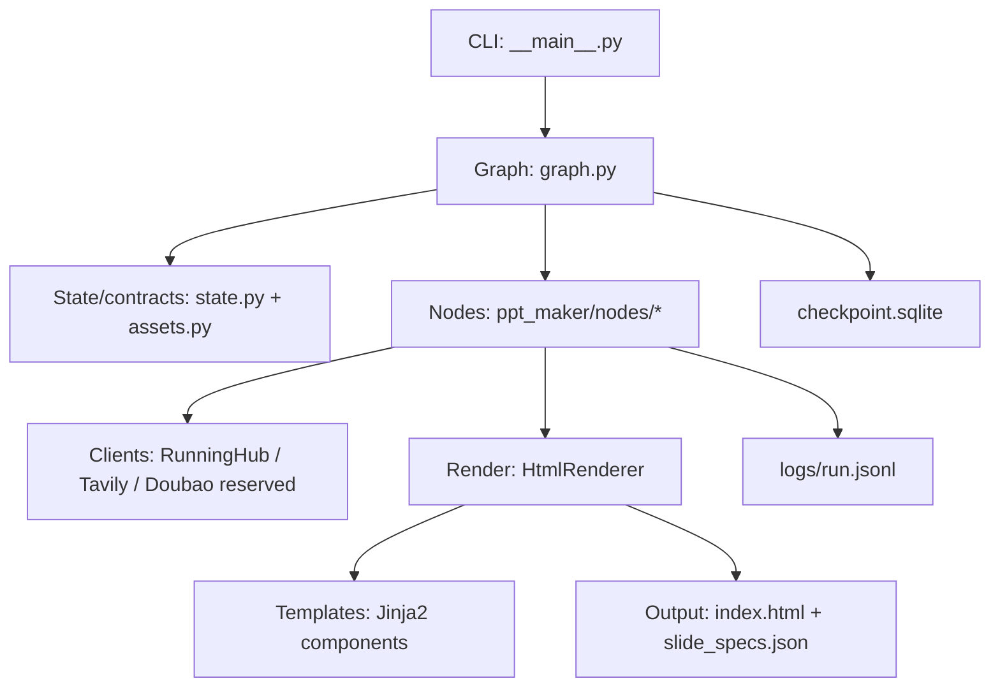
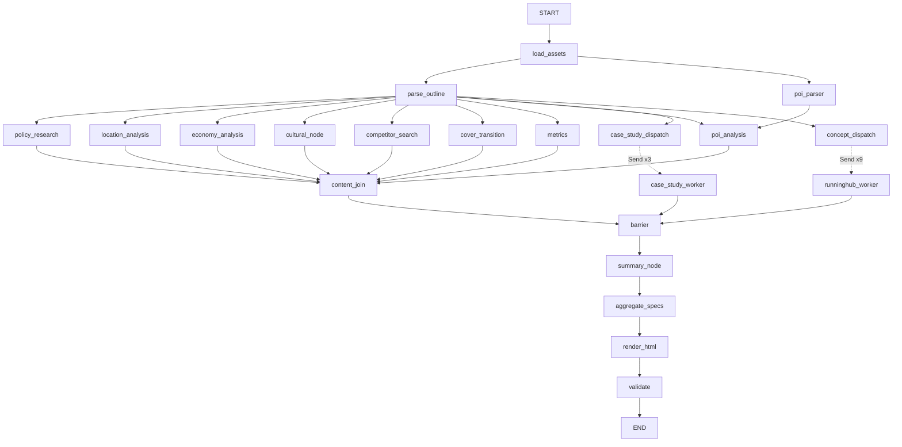
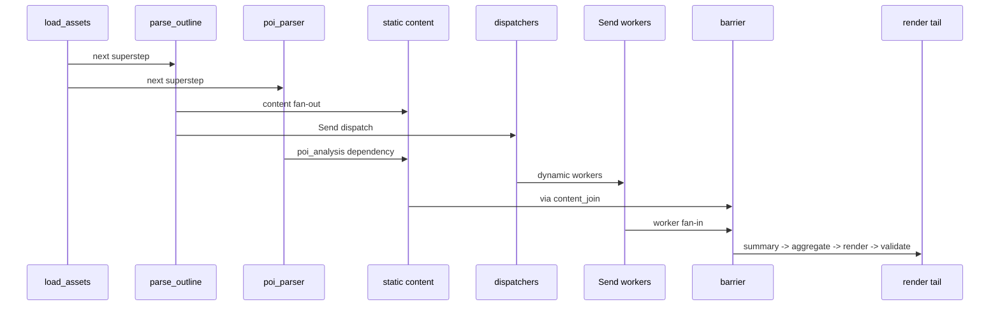
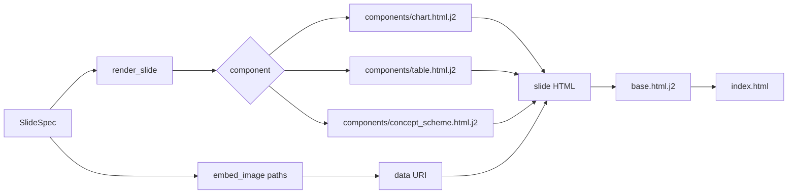
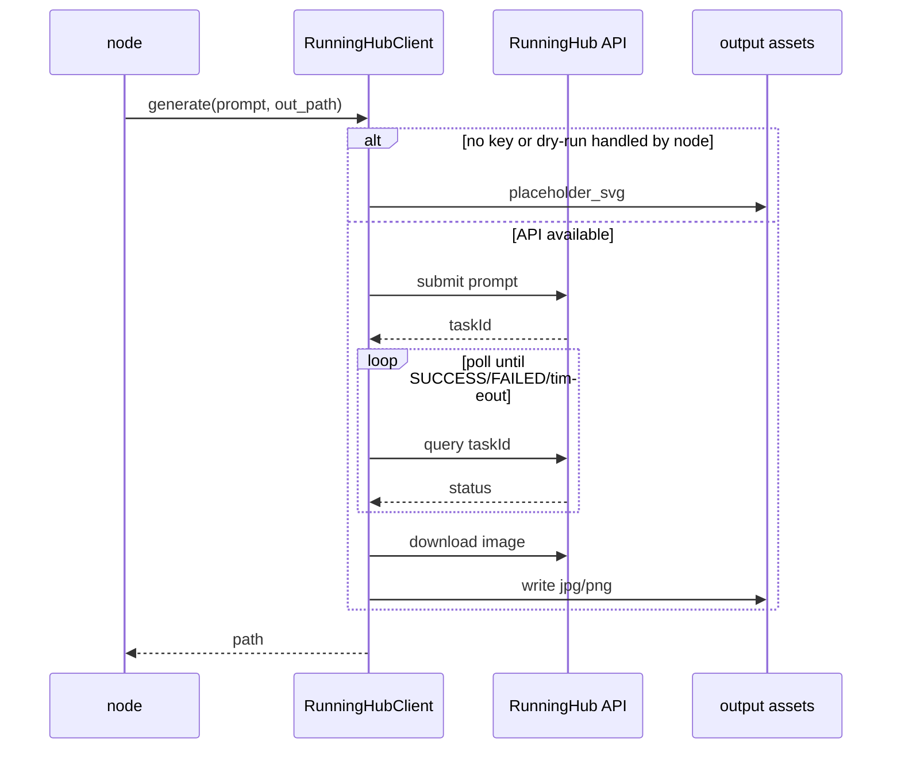
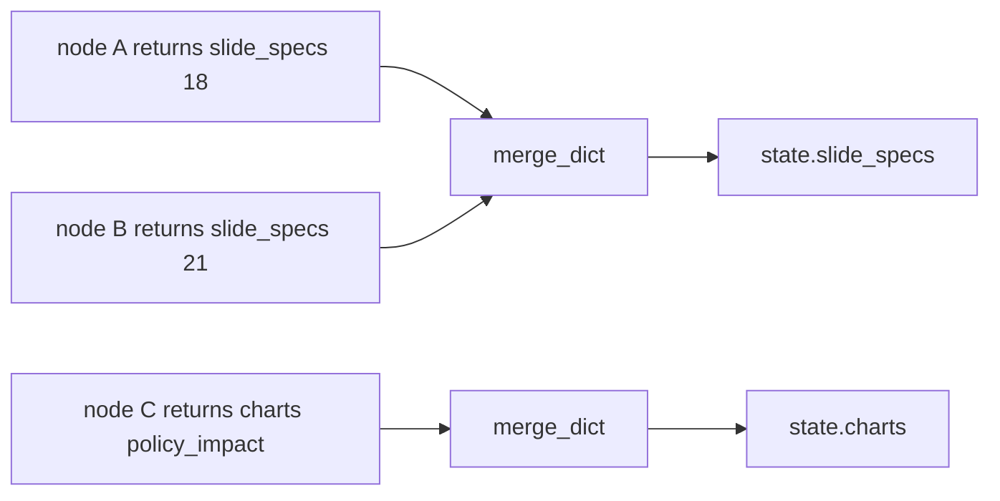
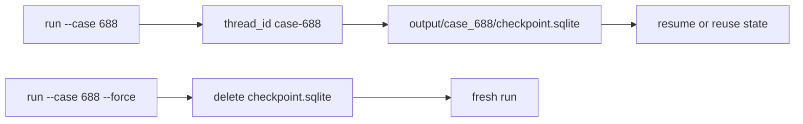

# 图集

> **读完这篇，你应该能回答：**
> - 项目的层次、拓扑、并发、渲染和外部服务时序分别长什么样？
> - 哪张图应该被其他文档引用？
> - reducer、checkpoint、RunningHub fallback 的关系怎么解释？

> **关联文档：**
> - 主链路：[pipeline.md](pipeline.md)
> - LangGraph：[langgraph.md](langgraph.md)
> - 模板系统：[templates.md](templates.md)

## 图 1：分层架构

## 图 2：完整 LangGraph 拓扑

## 图 3：superstep 时序

## 图 4：HtmlRenderer 数据流

## 图 5：RunningHub 调用时序

## 图 6：reducer 合并

浅合并规则：不同 key 合并，同 key 后写覆盖前写。

## 图 7：checkpoint 与 thread_id

