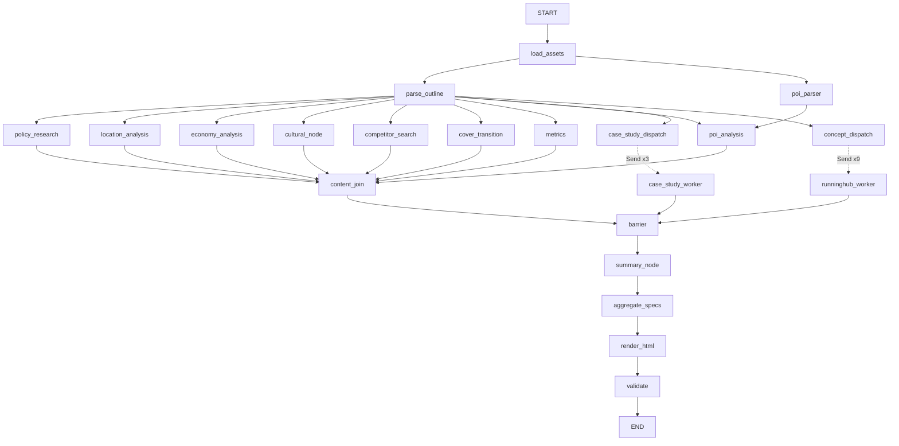
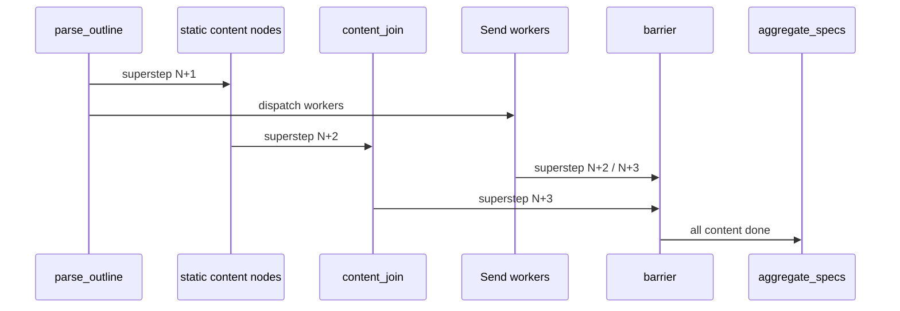

# LangGraph 构造说明

> **读完这篇，你应该能回答：**
> - `StateGraph(ProjectState)` 如何把节点、边、并发和 checkpoint 组装起来？
> - `Send`、reducer、superstep、barrier 在这个项目里各解决什么问题？
> - 节点失败后为什么 graph 不会直接崩？
> - 新增节点时最容易漏掉哪些地方？

> **关联文档：**
> - 上一篇：[pipeline.md](pipeline.md)
> - 下一篇：[data.md](data.md)
> - 术语：[glossary.md](glossary.md)

## 如果你刚接触 LangGraph

把 `ProjectState` 想成一个会被多个节点同时编辑的共享 dict：

| 概念 | 在本项目里的意思 |
|---|---|
| `StateGraph(ProjectState)` | 声明 graph 的共享 state 结构 |
| 节点函数 | `(state) -> dict`，返回局部更新 |
| 普通边 | 固定依赖关系 |
| 条件边 + `Send` | 运行时动态 fan-out，多发几个 worker |
| reducer | 多个并发节点写同一个 key 时怎么合并 |
| superstep | 同一批可并发执行的节点；下一批等上一批全完成 |
| checkpoint | 每个阶段保存状态，支持恢复 |

一句话：LangGraph 负责调度和合并，业务节点只负责读 state、产出局部更新。

## 完整拓扑



构图入口：[graph.py:64](../ppt_maker/graph.py#L64)

## `StateGraph(ProjectState)`

构图从：

```python
g = StateGraph(ProjectState)
```

开始。`ProjectState` 定义在 [state.py:176](../ppt_maker/state.py#L176)。里面最关键的是 reducer 字段：

| 字段 | reducer | 作用 |
|---|---|---|
| `slide_specs` | `merge_dict` | 多节点并行写不同页 |
| `charts` | `merge_dict` | 多节点写图表路径 |
| `generated_images` | `merge_dict` | 多节点写生成图路径 |
| `search_cache` | `merge_dict` | 缓存 Tavily 搜索结果 |
| `errors` | `operator.add` | 节点错误列表拼接 |

`merge_dict` 是浅合并，右侧覆盖左侧。正常情况下不同节点写不同页码；如果两个节点写同一页，后合并的值会覆盖前一个。

## 节点注册和包装

节点集中注册在 [nodes/__init__.py](../ppt_maker/nodes/__init__.py)。`build_graph()` 遍历注册表，把每个节点包一层 `_wrap_with_timer()`：

```python
for name, fn in NODE_REGISTRY.items():
    g.add_node(name, _wrap_with_timer(name, fn))
```

代码：[graph.py:67-68](../ppt_maker/graph.py#L67-L68)

## `_wrap_with_timer` 全解

包装器入口：[graph.py:44](../ppt_maker/graph.py#L44)

它做三件事：

| 职责 | 行为 |
|---|---|
| 计时 | 记录 `duration_s` |
| 产页计数 | 统计返回的 `slide_specs` 数量 |
| 异常隔离 | 捕获异常，返回 `{"errors": [NodeError(...)]}` |

失败路径不会让 graph 直接崩：

```python
except Exception as e:
    jsonl_event(..., ok=False, error=f"{type(e).__name__}: {e}")
    return {"errors": [NodeError(node=name, message=str(e))]}
```

因此一个节点失败后，后续仍可继续运行；最终缺失页面由 `aggregate_specs` 补 `[missing page N]`。

`logs/run.jsonl` 的典型字段：

| 字段 | 含义 |
|---|---|
| `node` | 节点名 |
| `ok` | 是否成功 |
| `duration_s` | 节点耗时 |
| `slides_emitted` | 成功时产出的页数 |
| `error` | 失败时的异常类型和消息 |

## 普通边和静态并行

入口边：

```python
START -> load_assets
load_assets -> parse_outline
load_assets -> poi_parser
```

代码：[graph.py:73-77](../ppt_maker/graph.py#L73-L77)

静态内容节点列表在 [graph.py:32](../ppt_maker/graph.py#L32)。除 `poi_analysis` 外，它们都从 `parse_outline` 发出；`poi_analysis` 同时依赖 `parse_outline` 和 `poi_parser`。

代码：[graph.py:80-85](../ppt_maker/graph.py#L80-L85)

## Send worker 的 state 传递

参考案例 fan-out：

```python
Send("case_study_worker", {"case_idx": i, **state})
```

代码：[case_study.py:13-14](../ppt_maker/nodes/case_study.py#L13-L14)

概念方案 fan-out：

```python
Send("runninghub_worker", {"scheme_idx": scheme_idx, "view": view, **state})
```

代码：[concept.py:26-31](../ppt_maker/nodes/concept.py#L26-L31)

为什么要 `**state`：worker 是独立调用的节点，它需要拿到 `outline`、`assets`、`output_dir`、`dry_run` 等上下文字段。worker 返回的 `slide_specs`、`generated_images` 由 reducer 合并回主 state。

## reducer 合并示例

```python
# 节点 A 返回
{"slide_specs": {18: spec_a}}

# 节点 B 同 superstep 并发返回
{"slide_specs": {21: spec_b}}

# merge_dict 合并后
state["slide_specs"] == {18: spec_a, 21: spec_b}
```

如果两个节点都返回 `{18: ...}`，浅合并会覆盖其中一个。排查页码冲突时，要对照 [pipeline.md](pipeline.md) 的 40 页表和各节点里的 `page=` 字面量。

## 为什么需要两层 barrier



`content_join` 只等待 8 个静态内容节点。`case_study_worker` 和 `runninghub_worker` 是 `Send` 动态分支，不属于 `content_join` 的上游集合，所以还需要第二层 `barrier`。

边定义：[graph.py:98-104](../ppt_maker/graph.py#L98-L104)

## Checkpoint 工作机制

CLI 创建：

```python
ckpt_path = Path(state["output_dir"]) / "checkpoint.sqlite"
thread_id = f"case-{case_id}"
config = {"configurable": {"thread_id": thread_id}}
```

代码：[__main__.py:64-69](../ppt_maker/__main__.py#L64-L69)

`get_checkpointer()` 用 sqlite 保存 LangGraph checkpoint：[graph.py:116](../ppt_maker/graph.py#L116)

关键行为：

| 行为 | 结果 |
|---|---|
| 同 case 再次运行 | 使用同一个 `thread_id`，可能复用 checkpoint |
| 中断后重跑 | 已保存的状态可恢复 |
| 使用 `--force` | CLI 删除 checkpoint 文件，相当于全新运行 |
| 只改模板 | 应优先用 `render-only`，不需要重跑 graph |

## 新增节点常见坑

| 坑 | 结果 | 修复 |
|---|---|---|
| 忘记进 `NODE_REGISTRY` | graph 里没有这个节点 | 在 [nodes/__init__.py](../ppt_maker/nodes/__init__.py) 注册 |
| 忘记连边 | 节点永远不会执行 | 在 [graph.py](../ppt_maker/graph.py) 加边 |
| 并发写字段没有 reducer | 并发合并报错或覆盖 | 在 `ProjectState` 加 reducer |
| 两个节点写同一页 | 后写覆盖前写 | 对照 40 页表修正页码 |
| 改了节点但结果没变 | checkpoint 复用旧状态 | 用 `--force` 或删 `checkpoint.sqlite` |
| `SlideSpec.component` 没进枚举 | Pydantic 构造失败 | 更新 [state.py:149](../ppt_maker/state.py#L149) |
