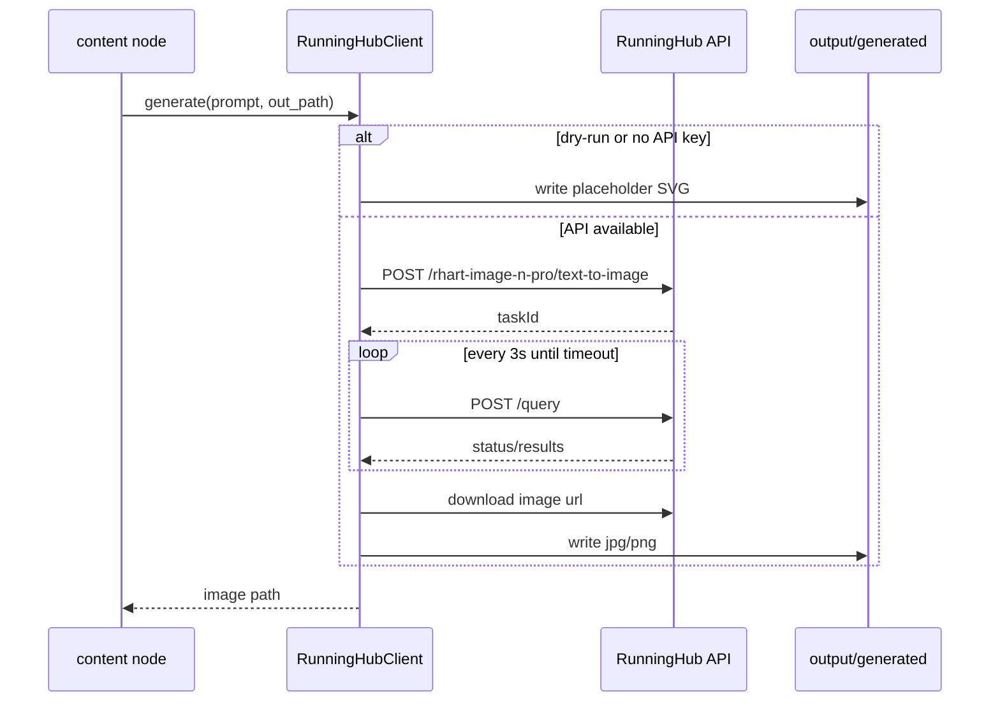

# AI 与外部服务全景

> **读完这篇你应该能回答：**
> - 当前 pipeline 哪些地方真的调用外部服务？
> - 哪些是硬编码、哪些是规则、哪些是 AI、哪些是外部 API？
> - 外部服务失败时怎么降级，deck 还能不能生成？
> - 如果想接入豆包 LLM，应该从哪一层开始动？

> **关联文档：**
> - 上一篇：[glossary.md](glossary.md)
> - 下一篇：[configuration.md](configuration.md)
> - 扩展指南：[extension-guide.md](extension-guide.md)

## 一句话现状

当前 pipeline **不调用任何 LLM 做文本生成**。豆包客户端 `DoubaoClient` 已实现，但没有任何节点引用它；外部 AI 只出现在 RunningHub 图像生成。

这意味着：当前文字内容来自 Python 字面量、正则/表格解析、Excel 映射、启发式打分和 Tavily 检索结果，不来自豆包。

## 外部依赖一览

| 服务 | 用途 | 当前是否真的被调用 | 关键代码 |
|---|---|---|---|
| RunningHub | text-to-image，生成文化图、概念图、logo/目录插图；失败时 SVG 占位 | 是 | [runninghub.py:105](../ppt_maker/clients/runninghub.py#L105) |
| Tavily | 联网检索同类产品，写入第 22 页表格 | 是 | [tavily.py:12](../ppt_maker/clients/tavily.py#L12) |
| 豆包 / Volcengine Ark | LLM 文本生成或结构化输出 | **否，待接入** | [doubao.py:18](../ppt_maker/clients/doubao.py#L18) |

## RunningHub 调用细节

关键行为：

| 行为 | 当前实现 |
|---|---|
| API base | `https://www.runninghub.cn/openapi/v2` |
| submit path | `/rhart-image-n-pro/text-to-image` |
| query path | `/query` |
| 认证 | `Authorization: Bearer <RUNNING_HUB_KEY>` |
| prompt 上限 | `PROMPT_MAX = 20000` |
| 画幅 | `1:1`, `16:9`, `9:16`, `4:3`, `3:4`, `3:2`, `2:3`, `5:4`, `4:5`, `21:9` |
| 清晰度 | `1k`, `2k`, `4k` |
| 轮询 | 默认每 3 秒一次，最多 300 秒 |
| 并发上限 | `threading.Semaphore(5)`，定义在 [runninghub.py:32-33](../ppt_maker/clients/runninghub.py#L32-L33) |
| transient 重试 | 3 次；2s、4s 指数退避 |
| 失败行为 | 写 SVG 占位图，并把原因写进 `hint` |

为什么用 `threading.Semaphore` 而不是 `asyncio.Semaphore`：LangGraph 同一个 superstep 可能用线程池并发执行多个节点，每个图像节点内部再 `asyncio.run()` 启动自己的 event loop。RunningHub 的并发限制要跨线程生效，所以用线程级 semaphore。

相关入口：

| 能力 | 代码 |
|---|---|
| SVG 占位图 | [runninghub.py:113](../ppt_maker/clients/runninghub.py#L113) |
| API 生成主流程 | [runninghub.py:126](../ppt_maker/clients/runninghub.py#L126) |
| logo SVG fallback | [runninghub.py:239](../ppt_maker/clients/runninghub.py#L239) |

## Tavily 调用细节

Tavily 是轻量封装，节点调用 `TavilyWrapper.search()` 得到列表结果。未配置 `TAVILY_API_KEY` 时直接返回空列表，不抛异常；调用失败时记录 warning 并返回空列表。

| 行为 | 当前实现 |
|---|---|
| client 创建 | lazy import `TavilyClient` |
| 搜索深度 | `search_depth="basic"` |
| 默认数量 | `max_results=5` |
| 未配置 key | 返回 `[]` |
| 异常 | 捕获异常，返回 `[]` |

代码入口：[tavily.py:28](../ppt_maker/clients/tavily.py#L28)。

## 豆包客户端现状

`DoubaoClient` 已经实现两个能力：

| 方法 | 用途 |
|---|---|
| `chat()` | 调 OpenAI-compatible chat completions，返回文本 |
| `structured()` | 要求模型输出 JSON，并用 Pydantic schema 校验 |

代码入口：

| 能力 | 代码 |
|---|---|
| 客户端类 | [doubao.py:18](../ppt_maker/clients/doubao.py#L18) |
| `chat()` | [doubao.py:37](../ppt_maker/clients/doubao.py#L37) |
| `structured()` | [doubao.py:52](../ppt_maker/clients/doubao.py#L52) |

当前没有节点调用 `DoubaoClient`。如果要接入，推荐在节点层把 LLM 输出写进 `SlideSpec.data`，模板层保持不变。一个低风险入口是把 [policy.py](../ppt_maker/nodes/policy.py) 的 `_impact_score()` 从关键词启发式替换成 `doubao.structured(...)`，并保留启发式兜底。

## 当前没有什么

| 不存在的能力 | 影响 |
|---|---|
| 内容质量审查 | 不会检查政策摘要、表格内容和项目输入是否一致 |
| LLM-as-judge | 没有模型复核生成结果 |
| 截图回看 | 渲染后不会截图检查视觉问题 |
| RAG / vector search | 输入资料不会进入向量库，也没有语义检索 |
| 跨节点业务缓存 | 除 LangGraph checkpoint 外，没有独立缓存层 |
| 模板字段契约校验 | `SlideSpec.data` 内部字段不由 Pydantic 校验 |

`validate.py` 只做完整性检查：页数、页码连续性和 `index.html` 是否存在。它不检查内容质量。

## 想加 LLM 节点该怎么做

推荐原则：

1. 在节点层调用 LLM，不在模板层调用。
2. LLM 输出先进入结构化 schema，再写入 `SlideSpec.data`。
3. 始终保留规则或启发式兜底。
4. 超时、缺 key、解析失败都不应该阻断 HTML 渲染。
5. 新增节点后同步更新 [pipeline.md](pipeline.md)、[data.md](data.md)、[templates.md](templates.md) 和 [debugging.md](debugging.md)。

具体 walkthrough 后续放在 [extension-guide.md](extension-guide.md) 的“把启发式换成 LLM”小节。
