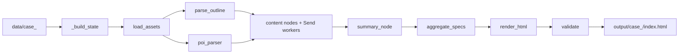
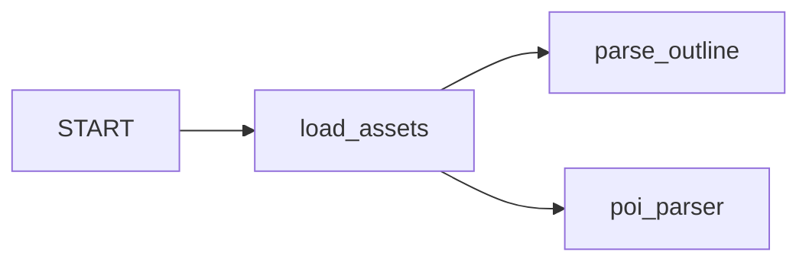

# 一次运行链路

> **读完这篇，你应该能回答：**
> - 一次 `run` 的输入、输出、内部步骤是什么？
> - 哪些页面来自硬编码、规则抽取、启发式、外部图像或外部检索？
> - 哪些节点失败时会降级，最终 deck 会显示什么？
> - 想定位某一页从哪里来，应该看哪段代码？

> **关联文档：**
> - 上一篇：[README.md](README.md)
> - 下一篇：[langgraph.md](langgraph.md)
> - 数据契约：[data.md](data.md)

## 一句话流程



最终输出目录：

```text
output/case_<id>/
  index.html
  slide_specs.json
  assets/
    charts/
    generated/
  checkpoint.sqlite
  logs/run.jsonl
```

## 阶段 0：CLI 入口预处理

入口在 [__main__.py:61](../ppt_maker/__main__.py#L61)。`run` 命令先调用 `_build_state()` 构造初始 `ProjectState`：

```python
state = _build_state(case_id, template, dry_run or no_images)
```

代码：[__main__.py:20](../ppt_maker/__main__.py#L20)、[__main__.py:63](../ppt_maker/__main__.py#L63)

这一步做四件事：

| 动作 | 结果 |
|---|---|
| 解析 `--case` | 得到 `data/case_<id>` |
| 解析 `--template` | 默认 `minimalist_architecture` |
| 合并 `--dry-run` 和 `--no-images` | 两者都会让 `state["dry_run"] = True` |
| 初始化 reducer 字段 | `slide_specs`、`charts`、`generated_images`、`search_cache` 为空 dict，`errors` 为空 list |

随后 CLI 创建 checkpoint 路径和 `thread_id`：

| 字段 | 代码 | 含义 |
|---|---|---|
| `checkpoint.sqlite` | [__main__.py:64](../ppt_maker/__main__.py#L64) | 当前 case 的 LangGraph 状态快照 |
| `thread_id = case-<id>` | [__main__.py:68](../ppt_maker/__main__.py#L68) | 同一个 case 多次运行复用同一线程 |

## 阶段 1：入口节点

`load_assets` 是 graph 的第一个节点：



边定义：[graph.py:73-77](../ppt_maker/graph.py#L73-L77)

## 阶段 2：读取和解析输入资料

### `load_assets`

输入：`state["case_dir"]`

输出：

| 字段 | 用途 |
|---|---|
| `assets` | case 目录的语义键索引 |
| `user_input` | 用户输入表解析结果 |
| `site_coords` | 经纬度、地址、省份 |
| `project_id` | 当前 case id |

语义键来自文件名尾缀剥离，例如 `设计建议书大纲_688.md` 变成 `设计建议书大纲`。完整契约见 [data.md](data.md)。

### `parse_outline`

输入：`assets.docs["设计建议书大纲"]`

输出：`outline: DesignOutline`

这一步是**纯规则解析，零 LLM 调用**。关键步骤：

| helper | 作用 | 代码 |
|---|---|---|
| `_split_sections()` | 按 markdown 标题拆章节 | [outline.py:19](../ppt_maker/nodes/outline.py#L19) |
| `_parse_table()` | 解析 markdown 管道表格 | [outline.py:38](../ppt_maker/nodes/outline.py#L38) |
| `_numbered_items()` | 提取 `1. **标题** ...` 编号项 | [outline.py:55](../ppt_maker/nodes/outline.py#L55) |
| `_bold_field()` | 提取 `**字段**：值` | [outline.py:65](../ppt_maker/nodes/outline.py#L65) |

它生成政策、产业政策、上位规划、文化特征、经济摘要、区位分析、参考案例、设计策略和 3 个概念方案 seed。

### `poi_parser`

输入：`assets.xlsx["场地poi"]`

输出：`poi_data: POIData`

`poi_parser` 根据 `SHEET_MAP` 读取 Excel sheet。sheet 名不匹配时，对应列表为空，不阻断工作流。入口：[poi.py:22](../ppt_maker/nodes/poi.py#L22)，sheet 映射：[poi.py:13](../ppt_maker/nodes/poi.py#L13)。

## 阶段 3：并行内容生成

`parse_outline` 完成后，大多数内容节点可以并行，因为它们主要读取 `outline` 并写不同页码的 `SlideSpec`。静态内容节点列表在 [graph.py:32](../ppt_maker/graph.py#L32)。

内容来源按下面分类：

| 来源类别 | 含义 | 当前节点 | 是否走 LLM |
|---|---|---|---|
| Python 字面量 | 硬编码字符串/字典 | `summary_node`, `cover_transition`, `ending` | 否 |
| 规则抽取 | 正则、markdown 表格、Excel 映射 | `outline`, `poi_parser`, `policy`, `location`, `economy`, `poi_analysis`, `metrics` | 否 |
| 启发式打分 | 关键词命中数转数值 | `policy._impact_score` | 否 |
| 外部 LLM 文本 | 调豆包做摘要或抽取 | 当前无 | `DoubaoClient` 已就绪但未被调用 |
| 外部图像 | RunningHub text-to-image | `cultural_node`, `runninghub_worker`, `cover_transition` | 是，图像模型 |
| 外部检索 | Tavily 搜索 | `competitor_search` | 否 |

注意：当前文本生成没有 LLM。详见 [llm-and-external-services.md](llm-and-external-services.md)。

## 40 页生成来源

| 页码 | 内容 | 生成节点 | 来源类别 | 失败时显示 |
|---:|---|---|---|---|
| 1 | 封面 | `cover_transition` | 字面量 + RunningHub logo | logo 变 SVG 或不显示 |
| 2 | 目录 | `cover_transition` | 字面量 + RunningHub 插图 | 插图变 SVG 或不显示 |
| 3 | 章节过渡：项目背景 | `cover_transition` | 字面量 | 不易失败 |
| 4-5 | 政策解读 | `policy_research` | 规则抽取 `outline.policies` | 政策列表为空 |
| 6 | 政策影响图表 | `policy_research` | 规则 + 启发式打分 + matplotlib | 空图或缺图 |
| 7 | 上位规划条件 | `policy_research` | 规则抽取 `outline.upper_plans` | 表格为空 |
| 8 | 区位优势概览 | `location_analysis` | 规则抽取 + 输入图片 | 图片或文本缺失 |
| 9 | 文化特征 | `cultural_node` | 规则抽取 + RunningHub | SVG 占位图 |
| 10-12 | 城市经济、产业、消费 | `economy_analysis` | 规则抽取 + 输入图片 | 图片或摘要缺失 |
| 13 | 章节过渡：场地分析 | `cover_transition` | 字面量 | 不易失败 |
| 14-17 | 场地四至 / 区位图页 | `location_analysis` | 规则抽取 + 输入图片 | 图片或文本缺失 |
| 18 | 周边业态与 POI | `poi_analysis` | Excel 规则抽取 | 空表或占位 |
| 19 | 场地综合分析 | `summary_node` | **完全字面量** | 不依赖输入 |
| 20 | 章节过渡：项目定位 | `cover_transition` | 字面量 | 不易失败 |
| 21 | 附近同类型产品 | `poi_analysis` | Excel 规则抽取 | 空表或占位 |
| 22 | 同类产品检索 | `competitor_search` | Tavily | 未配置说明或空表 |
| 23-25 | 参考案例 1-3 | `case_study_worker` | 规则抽取 + 输入图片 | 案例字段变少或占位 |
| 26 | 项目定位总结 | `summary_node` | **完全字面量** | 不依赖输入 |
| 27 | 章节过渡：设计方案 | `cover_transition` | 字面量 | 不易失败 |
| 28 | 设计策略 | `cover_transition` | 规则抽取 + 字面量 | 策略列表为空 |
| 29-37 | 3 个概念方案，每个 3 个视角 | `runninghub_worker` | RunningHub | SVG 占位，hint 标原因 |
| 38 | 方案指标矩阵 | `metrics` | 用户输入 + 规则计算 | 表格为空或默认值 |
| 39 | 设计任务书 | `summary_node` | **完全字面量** | 不依赖输入 |
| 40 | 结束页 | `cover_transition` | 字面量 | 不易失败 |

## 阶段 4：Send worker 和两层 barrier

有两类页面使用 LangGraph `Send` 动态展开：

| dispatcher | worker | 数量 | 页码 | 代码 |
|---|---|---:|---|---|
| `case_study_dispatch` | `case_study_worker` | 3 | 23-25 | [case_study.py:13-14](../ppt_maker/nodes/case_study.py#L13-L14) |
| `concept_dispatch` | `runninghub_worker` | 9 | 29-37 | [concept.py:26-31](../ppt_maker/nodes/concept.py#L26-L31) |

图里有两个 no-op 汇合点：

| barrier | 等什么 | 为什么需要 |
|---|---|---|
| `content_join` | 8 个静态内容节点 | 静态节点先汇合 |
| `barrier` | `content_join` + 两组 Send worker | Send worker 不在 `content_join` 同一层，必须再等一层 |

边定义：[graph.py:98-104](../ppt_maker/graph.py#L98-L104)

没有第二层 `barrier` 时，`summary_node` 或 `aggregate_specs` 可能在 23-25、29-37 页还没写入时提前执行。

## 阶段 5：汇总、渲染、校验

### `summary_node`

生成第 19、26、39 页。当前主要是 Python 字面量，不根据输入内容做 LLM 总结。

### `aggregate_specs`

职责：

1. 确保 1-40 页都有 `SlideSpec`。
2. 缺页时写入 `[missing page N]` 占位页。
3. 落盘 `slide_specs.json`。

缺页兜底代码：[aggregate.py:17-25](../ppt_maker/nodes/aggregate.py#L17-L25)

### `render_html`

读取排序后的 `slide_specs`，调用 `HtmlRenderer`，写出 `index.html`。入口：[render.py:13](../ppt_maker/nodes/render.py#L13)

模板细节见 [templates.md](templates.md)。

### `validate`

只检查三件事：

| 检查 | 代码 |
|---|---|
| 是否正好 40 页 | [validate.py:18](../ppt_maker/nodes/validate.py#L18) |
| 页码是否连续 | [validate.py:19](../ppt_maker/nodes/validate.py#L19) |
| `index.html` 是否存在 | [validate.py:23](../ppt_maker/nodes/validate.py#L23) |

它**不检查内容质量**，也不校验 `SlideSpec.data` 是否符合模板契约。

## 错误与降级

节点外层由 `_wrap_with_timer()` 包装。节点抛异常时，错误进入 `errors[]`，日志写入 `logs/run.jsonl`，graph 继续运行。包装器入口：[graph.py:44](../ppt_maker/graph.py#L44)

详细降级矩阵集中放在 [configuration.md](configuration.md)，排查路径见 [debugging.md](debugging.md)。
