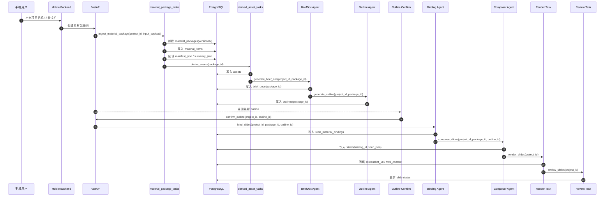
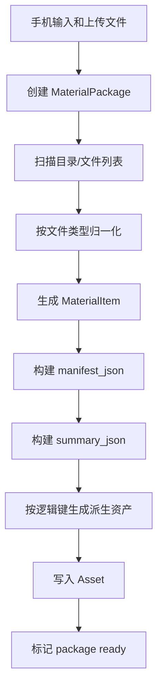
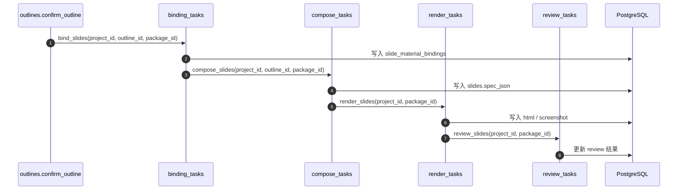
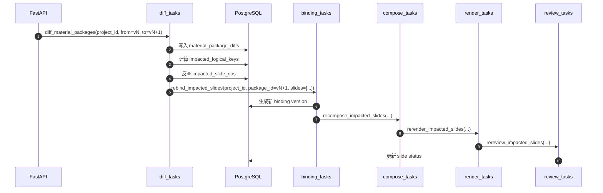

# 素材包改造实施附录

本文档是 [20_material_package_integration.md](./20_material_package_integration.md) 的实施附录，重点展开三部分内容：

1. 数据库表结构草案
2. 任务时序图
3. 逐文件改造 checklist

目标是把上一份架构文档进一步拆成可执行的工程清单，便于分阶段落地、拆任务和做代码评审。

## 1. 数据库表结构草案

### 1.1 设计原则

数据库层需要解决四个问题：

1. 如何表达“某次手机输入之后生成的一整包素材”
2. 如何表达素材包中的每个原始文件和归一化条目
3. 如何表达某一页最终绑定了哪些素材
4. 如何把 `BriefDoc`、`Outline`、`Slide`、`Asset` 这些中间产物和具体素材包版本关联起来

### 1.2 新增表一览

建议新增以下表：

- `material_packages`
- `material_items`
- `slide_material_bindings`
- `material_package_diffs`

其中前三张表是主链路必须项，`material_package_diffs` 是增量重生成的推荐项。

### 1.3 `material_packages`

#### 表职责

- 表示某个项目的一次素材包快照
- 记录素材包版本、清单、摘要和来源
- 为所有中间产物提供稳定版本引用

#### 推荐字段

```sql
create table material_packages (
    id uuid primary key,
    project_id uuid not null references projects(id),
    version integer not null,
    status varchar(50) not null default 'ready',
    source_hash varchar(128),
    manifest_json jsonb,
    summary_json jsonb,
    created_from jsonb,
    created_at timestamptz not null default now(),
    updated_at timestamptz not null default now()
);

create unique index uq_material_packages_project_version
    on material_packages(project_id, version);

create index ix_material_packages_project_id
    on material_packages(project_id);
```

#### 字段说明

- `version`: 同一项目下递增版本号
- `status`: 推荐值 `pending / ingesting / normalizing / deriving / ready / failed`
- `source_hash`: 基于输入目录内容或上传文件集合生成的哈希，用于粗粒度去重
- `manifest_json`: 素材清单，面向流程消费
- `summary_json`: 素材包摘要，面向 LLM 和 UI
- `created_from`: 记录手机端输入快照、上传列表、生成规则版本等来源信息

### 1.4 `material_items`

#### 表职责

- 记录素材包中的每个归一化文件
- 作为“原始证据层”
- 为派生资产、页级 binding、LLM 证据引用提供统一主键

#### 推荐字段

```sql
create table material_items (
    id uuid primary key,
    package_id uuid not null references material_packages(id),
    logical_key varchar(255) not null,
    kind varchar(50) not null,
    format varchar(50) not null,
    title varchar(500),
    source_path text,
    preview_url varchar(1000),
    content_url varchar(1000),
    text_content text,
    structured_data jsonb,
    tags jsonb,
    source_hash varchar(128),
    metadata_json jsonb,
    created_at timestamptz not null default now(),
    updated_at timestamptz not null default now()
);

create index ix_material_items_package_id
    on material_items(package_id);

create index ix_material_items_logical_key
    on material_items(logical_key);

create unique index uq_material_items_package_key_hash
    on material_items(package_id, logical_key, source_hash);
```

#### `kind` 建议枚举值

- `image`
- `document`
- `spreadsheet`
- `chart_bundle`
- `table`
- `json`
- `html`
- `ocr_text`

#### `metadata_json` 建议字段

```json
{
  "basename": "经济背景 - 城市经济_chart_0_285",
  "variants": {
    "json": "xxx.json",
    "svg": "xxx.svg",
    "html": "xxx.html"
  },
  "ocr_summary": "...",
  "sheet_names": ["Sheet1"],
  "image_size": {"width": 1920, "height": 1080}
}
```

### 1.5 `slide_material_bindings`

#### 表职责

- 记录某页使用了哪些素材
- 让页面生成由“语义需求”落地成“具体资源选择”
- 为后续渲染、审查、增量重生成提供依赖依据

#### 推荐字段

```sql
create table slide_material_bindings (
    id uuid primary key,
    project_id uuid not null references projects(id),
    package_id uuid not null references material_packages(id),
    outline_id uuid references outlines(id),
    slide_id uuid references slides(id),
    slide_no integer not null,
    slot_id varchar(100) not null,
    version integer not null default 1,
    status varchar(50) not null default 'ready',
    must_use_item_ids jsonb,
    optional_item_ids jsonb,
    derived_asset_ids jsonb,
    evidence_snippets jsonb,
    coverage_score numeric(5,4),
    missing_requirements jsonb,
    binding_reason text,
    created_at timestamptz not null default now(),
    updated_at timestamptz not null default now()
);

create index ix_slide_material_bindings_project_package
    on slide_material_bindings(project_id, package_id);

create index ix_slide_material_bindings_slide_no
    on slide_material_bindings(project_id, slide_no);

create unique index uq_slide_material_bindings_project_package_slide_version
    on slide_material_bindings(project_id, package_id, slide_no, version);
```

#### 说明

- `outline_id`: 绑定生成时所依据的大纲版本
- `slide_id`: 绑定结果被写入具体 slide 后可回填
- `version`: 支持同一页面针对同一素材包反复重绑
- `must_use_item_ids`: 本页必须消费的 `MaterialItem`
- `optional_item_ids`: 本页可选参考项
- `derived_asset_ids`: 页面直接渲染应使用的派生资产

### 1.6 `material_package_diffs`

#### 表职责

- 记录两个素材包版本之间的差异
- 为增量重生成提供缓存

#### 推荐字段

```sql
create table material_package_diffs (
    id uuid primary key,
    project_id uuid not null references projects(id),
    from_package_id uuid not null references material_packages(id),
    to_package_id uuid not null references material_packages(id),
    diff_json jsonb not null,
    impacted_logical_keys jsonb,
    impacted_slide_nos jsonb,
    created_at timestamptz not null default now()
);

create unique index uq_material_package_diffs_pair
    on material_package_diffs(from_package_id, to_package_id);
```

### 1.7 现有表改造建议

#### `assets`

当前 [db/models/asset.py](../db/models/asset.py) 还是通用资产模型，需要补齐素材包上下文。

建议新增字段：

```sql
alter table assets add column package_id uuid references material_packages(id);
alter table assets add column source_item_id uuid references material_items(id);
alter table assets add column logical_key varchar(255);
alter table assets add column variant varchar(50);
alter table assets add column render_role varchar(100);
alter table assets add column is_primary boolean not null default false;
```

建议新增索引：

```sql
create index ix_assets_package_id on assets(package_id);
create index ix_assets_source_item_id on assets(source_item_id);
create index ix_assets_logical_key on assets(logical_key);
```

#### `brief_docs`

当前 [db/models/brief_doc.py](../db/models/brief_doc.py) 没有标明它是基于哪个素材包生成的。

建议新增字段：

```sql
alter table brief_docs add column package_id uuid references material_packages(id);
alter table brief_docs add column material_summary_json jsonb;
alter table brief_docs add column evidence_keys_json jsonb;
```

#### `outlines`

当前 [db/models/outline.py](../db/models/outline.py) 没有绑定素材包版本，也没有保存素材覆盖率信息。

建议新增字段：

```sql
alter table outlines add column package_id uuid references material_packages(id);
alter table outlines add column coverage_json jsonb;
alter table outlines add column slot_binding_hints_json jsonb;
```

#### `slides`

当前 [db/models/slide.py](../db/models/slide.py) 应补齐 binding 追踪。

建议新增字段：

```sql
alter table slides add column package_id uuid references material_packages(id);
alter table slides add column binding_id uuid references slide_material_bindings(id);
alter table slides add column source_refs_json jsonb;
alter table slides add column evidence_refs_json jsonb;
```

### 1.8 唯一键和约束建议

建议落实以下约束：

1. 同一项目的素材包版本唯一
2. 同一素材包内，同一 `logical_key + source_hash` 唯一
3. 同一项目、同一素材包、同一页、同一 binding 版本唯一
4. 同一派生资产应可追溯到素材包和原始 `MaterialItem`

### 1.9 Alembic 迁移拆分建议

建议按三次 migration 拆：

#### Migration A

- 新增 `material_packages`
- 新增 `material_items`
- 扩展 `assets`

#### Migration B

- 新增 `slide_material_bindings`
- 扩展 `brief_docs`
- 扩展 `outlines`
- 扩展 `slides`

#### Migration C

- 新增 `material_package_diffs`
- 补充索引和数据回填脚本

### 1.10 ORM 文件建议

建议新增：

- `db/models/material_package.py`
- `db/models/material_item.py`
- `db/models/slide_material_binding.py`

建议同步扩展：

- `schema/asset.py`
- `schema/outline.py`
- `schema/slide.py`
- `schema/common.py`

## 2. 任务时序图

### 2.1 初次生成全链路

此链路适用于“手机用户新输入了一轮信息，后台产出一个全新素材包，然后生成大纲和页面”。



### 2.2 素材包内部流水线

此链路用于表达素材包内部从原始目录到派生资产的处理过程。



### 2.3 大纲确认后的页面生成链路

当前仓库里 [api/routers/outlines.py](../api/routers/outlines.py) 的 `confirm_outline` 会直接启动 `_compose_render_worker`。改造后应拆成更清晰的异步链路。



### 2.4 素材包更新后的增量重生成链路

此链路适用于“用户补充了新的案例或地图，后台生成 `package_vN+1` 后，只重跑受影响页面”。



### 2.5 失败与降级路径

建议定义以下降级和失败策略：

1. `normalize` 失败：素材包状态设为 `failed`，不进入下游流程
2. 某个 `MaterialItem` 解析失败：记录 item 级错误，但素材包可继续生成
3. `Binding` 缺少必需素材：输出 `missing_requirements`，页面状态设为 `needs_fallback`
4. `Composer` 遇到缺素材页面：使用降级布局，不能伪造图表或案例
5. `Review` 发现“页面未使用必需素材”：转 `repair_needed`

### 2.6 推荐 Celery 任务命名

建议新增以下任务：

- `tasks.material_package_tasks.ingest_material_package`
- `tasks.material_package_tasks.normalize_material_items`
- `tasks.derived_asset_tasks.derive_assets`
- `tasks.outline_tasks.generate_brief_doc_from_package`
- `tasks.outline_tasks.generate_outline_from_package`
- `tasks.binding_tasks.bind_slides`
- `tasks.binding_tasks.rebind_impacted_slides`
- `tasks.render_tasks.render_slides`
- `tasks.review_tasks.review_slides`
- `tasks.incremental_regen_tasks.diff_material_packages`
- `tasks.incremental_regen_tasks.regenerate_impacted_slides`

## 3. 逐文件改造 checklist

本节按目录拆分。建议把每一条 checklist 当成一个最小任务单元。

### 3.1 配置与 Schema 层

- [ ] `config/ppt_blueprint.py`: 把当前松散的 `required_inputs: list[str]` 升级为结构化输入要求；所有 slot 改成统一逻辑键；验收标准是每个 slot 都能对 manifest 计算覆盖率。
- [ ] `schema/page_slot.py`: 新增 `InputRequirement`、`BindingHint` 等结构；让 `PageSlot`、`PageSlotGroup`、`SlotAssignment` 显式携带素材需求和推荐绑定范围。
- [ ] `schema/common.py`: 扩展 `ProjectStatus`、`AssetType`，补充素材包相关状态和值域；验收标准是新任务链可以用状态机表达 `MATERIAL_READY`、`BINDING`、`REGENERATING` 等阶段。
- [ ] `schema/asset.py`: 为 `AssetRead` 增加 `package_id`、`source_item_id`、`logical_key`、`variant`、`render_role`；验收标准是 API 可以返回派生资产与原始素材的关系。
- [ ] `schema/outline.py`: 为 `OutlineSlideEntry` 增加 `required_input_keys`、`optional_input_keys`、`coverage_status`、`recommended_binding_scope`；验收标准是 outline 输出能直接驱动 binding。
- [ ] `schema/slide.py`: 为 `SlideRead` 或新增结构增加 `binding_id`、`source_refs`、`evidence_refs`；验收标准是页面详情接口能返回素材来源追踪信息。
- [ ] `schema/visual_theme.py`: 在 `LayoutSpec` 或 block 级结构里加 `binding_id`、`source_refs`、`evidence_refs`；验收标准是渲染器和 review 能读到页面块的素材来源。
- [ ] `schema/material_package.py`: 新建素材包相关 schema；验收标准是 API 层不需要直接暴露 ORM 模型。

### 3.2 数据模型层

- [ ] `db/models/material_package.py`: 新增 `MaterialPackage` ORM；验收标准是可持久化素材包版本、manifest、summary。
- [ ] `db/models/material_item.py`: 新增 `MaterialItem` ORM；验收标准是素材包中的每个归一化文件都能落库。
- [ ] `db/models/slide_material_binding.py`: 新增 `SlideMaterialBinding` ORM；验收标准是每页的 binding 结果可版本化存储。
- [ ] `db/models/asset.py`: 扩展派生资产字段；验收标准是每个资产可追溯到素材包和原始素材。
- [ ] `db/models/brief_doc.py`: 增加 `package_id` 和素材摘要字段；验收标准是 BriefDoc 能与具体素材包版本关联。
- [ ] `db/models/outline.py`: 增加 `package_id` 和覆盖率字段；验收标准是 Outline 可追溯到素材包版本。
- [ ] `db/models/slide.py`: 增加 `package_id`、`binding_id`、来源引用字段；验收标准是 slide 能直接定位其 binding 记录。
- [ ] `db/models/__init__.py`: 导出新增模型；验收标准是 Alembic 和应用初始化可以看到新模型。

### 3.3 素材处理工具层

- [ ] `tool/material/ingest.py`: 新建素材包导入器；负责扫描目录、识别文件、创建包记录；验收标准是对 `test_material/project1` 能成功创建 `MaterialPackage`。
- [ ] `tool/material/normalize.py`: 新建归一化逻辑；按文件类型生成 `MaterialItem`；验收标准是 md/xlsx/png/json/svg/html 都能落到稳定逻辑键。
- [ ] `tool/material/resolver.py`: 新建 binding 解析器；负责把 slot 需求匹配成具体素材；验收标准是可对单页输出 `must_use_item_ids` 和 `derived_asset_ids`。
- [ ] `tool/material/summary.py`: 可选新增；负责生成素材摘要和 evidence snippets；验收标准是 BriefDoc 和 Composer 不需要重复做低级抽取。

### 3.4 Agent 层

- [ ] `agent/brief_doc.py`: 输入改为 `MaterialPackage` 摘要和关键素材证据；输出中加入 `evidence_keys` 和 `recommended_focus_keys`；验收标准是 BriefDoc 能总结素材包而不是只依赖 brief。
- [ ] `agent/outline.py`: 不再只读取浅层 `Asset` 摘要；改为读取 package manifest 和 coverage；验收标准是 `OutlineSlideEntry` 携带清晰的素材需求。
- [ ] `agent/material_binding.py`: 新建 binding agent；验收标准是可以从一个 `OutlineSlideEntry` 生成 `SlideMaterialBinding`。
- [ ] `agent/composer.py`: 只消费页级 binding，不消费项目全量素材；验收标准是图表、图片、案例卡片都来自 binding 结果，输出包含 `source_refs`。
- [ ] `agent/critic.py`: 新增素材一致性审查；验收标准是能发现“必需素材未使用”“案例串页”“图文来源不一致”。
- [ ] `agent/graph.py`: 若保留 LangGraph 主链路，需要把 `binding` 插入 `outline -> compose` 之间；验收标准是图中的节点顺序与新链路一致。

### 3.5 Render 与 Review 层

- [ ] `render/engine.py`: 加入 `resolve_best_variant()`、`render_chart_asset()`、`render_table_asset()`；验收标准是图表优先 html/svg，表格优先结构化数据。
- [ ] `render/exporter.py`: 评估是否需要感知 full-res / thumbnail 变体；验收标准是导出使用高清资产，预览可走轻量资源。
- [ ] `tool/review/layout_lint.py`: 增加素材使用规则；验收标准是能检查 block 是否引用了 binding 中的资产。
- [ ] `tool/review/repair_plan.py`: 扩展自动修复动作；验收标准是可对错误资产变体、遗漏素材引用做自动修复。

### 3.6 任务层

- [ ] `tasks/asset_tasks.py`: 从“直接生成少量资产”改为兼容层；逐步下线站点图、图表、案例硬编码产出；验收标准是新项目优先走 `material_package_tasks`。
- [ ] `tasks/material_package_tasks.py`: 新建 ingest 和 normalize 任务；验收标准是可把 `test_material/project1` 跑成 ready package。
- [ ] `tasks/derived_asset_tasks.py`: 新建派生资产任务；验收标准是 POI 表、图表 bundle、案例组都能生成页面可消费资产。
- [ ] `tasks/outline_tasks.py`: 接收 `package_id`，分别触发 BriefDoc 和 Outline；验收标准是 Outline 与 package 绑定。
- [ ] `tasks/binding_tasks.py`: 新建 bind 和 rebind 任务；验收标准是支持全量 binding 和按页 rebind。
- [ ] `tasks/render_tasks.py`: 改为显式消费 `package_id` 和 `binding_id`；验收标准是渲染过程能选择最佳资产变体。
- [ ] `tasks/review_tasks.py`: 扩展 review 入口参数；验收标准是可以只审受影响页，且能读到 binding 数据。
- [ ] `tasks/incremental_regen_tasks.py`: 新建 package diff 和局部重生成任务；验收标准是替换单个案例图只重跑相关页。

### 3.7 API 层

- [ ] `api/routers/material_packages.py`: 新建素材包接口；验收标准是支持 ingest、查询 package、查询 manifest、触发 diff。
- [ ] `api/routers/assets.py`: 拆分“原始素材浏览”和“派生资产浏览”；验收标准是前端能区分素材项和页面资产。
- [ ] `api/routers/outlines.py`: `confirm_outline` 改成显式触发 `binding -> compose -> render -> review` 链；验收标准是不再直接在线程里耦合全部步骤。
- [ ] `api/routers/slides.py`: 新增获取 slide binding 的接口，补齐真正的 `/slides/plan` 逻辑；验收标准是可查看每页的 binding 和来源引用。
- [ ] `api/routers/projects.py`: 可选增加“获取当前 package version”的接口；验收标准是前端能知道当前项目绑定的是哪个素材包版本。

### 3.8 测试与夹具

- [ ] `tests/material/test_ingest.py`: 覆盖素材包导入和逻辑键映射；验收标准是 `test_material/project1` 中关键文件都有稳定 logical key。
- [ ] `tests/material/test_normalize.py`: 覆盖 md/xlsx/chart bundle/image 归一化；验收标准是每类文件至少一条成功样例。
- [ ] `tests/agent/test_binding.py`: 覆盖 slot 到 item 的绑定规则；验收标准是关键页都能选到正确素材。
- [ ] `tests/agent/test_composer_binding_contract.py`: 验证 composer 输出 block 带有 `source_refs`；验收标准是关键页面不再产生无来源的图表块。
- [ ] `tests/e2e/test_project1_pipeline.py`: 跑 `test_material/project1` 全流程；验收标准是可生成有 binding 的 outline、slide 和 review 结果。
- [ ] `tests/e2e/test_incremental_regen.py`: 模拟素材包版本更新；验收标准是只重跑受影响页。

## 4. 建议 PR 拆分

为了降低评审和回归风险，建议按 5 个 PR 推进：

### PR-1 素材包底座

- 新增 `material_packages`
- 新增 `material_items`
- 新增 ingest / normalize
- 打通 `test_material/project1 -> manifest`

### PR-2 蓝图与 Outline 接线

- 升级 `PageSlot.required_inputs`
- 改造 `BriefDoc`
- 改造 `Outline`
- 让 outline 显式引用 package 版本

### PR-3 Binding 层

- 新增 `slide_material_bindings`
- 实现 `tool/material/resolver.py`
- 新增 `agent/material_binding.py`
- 打通 `outline -> binding`

### PR-4 Composer / Render / Review

- 改造 `composer.py`
- 改造 `render/engine.py`
- 改造 `critic.py` 和 `layout_lint.py`
- 让页面块具备来源追踪

### PR-5 增量重生成与 API 收口

- 新增 `material_package_diffs`
- 新增 diff / rebind / recompose / rerender
- 改造 API 路由
- 补齐 e2e 测试

## 5. 最小落地路径

如果希望先做一个可运行但不追求一步到位的 MVP，建议最先完成以下 6 项：

1. 新建 `material_packages` 和 `material_items`
2. 把 `test_material/project1` 跑成一份 manifest
3. 升级 `config/ppt_blueprint.py` 的 `required_inputs`
4. 新建 `slide_material_bindings`
5. 改造 `agent/composer.py` 只消费绑定结果
6. 改造 `api/routers/outlines.py` 让 confirm 后先 bind 再 compose

完成这 6 项后，系统就已经从“素材参考式生成”跨到“素材绑定式生成”，后续的渲染优化、审查增强和增量更新都能在这个基础上叠加。
